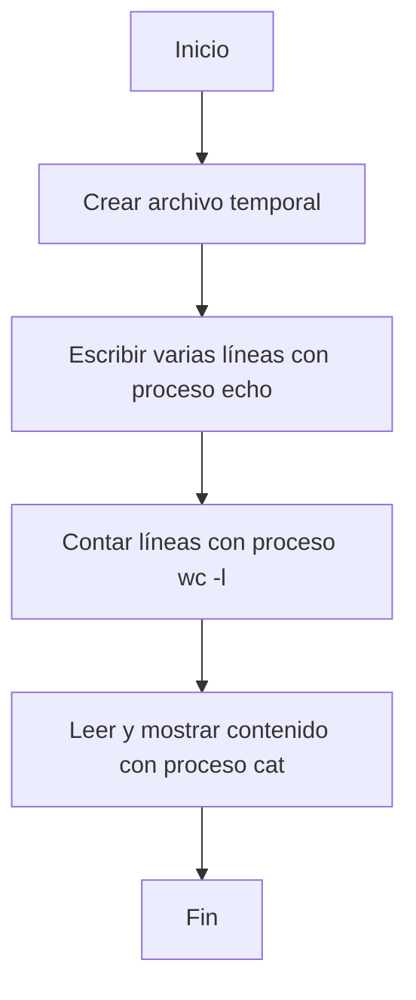

# Tema 1: Fundamentos de la Programación Concurrente y Procesos

Esta unidad introducirá los conceptos fundamentales de la ejecución paralela y la gestión del sistema operativo sobre los programas.    

## Contenidos

1. Introducción a la Programación Concurrente y Paralela
    - Características de la programación concurrente y sus ámbitos. 
    - Diferencias entre programación paralela y distribuida: ventajas e inconvenientes.
2. Gestión de Procesos por el Sistema Operativo
    - Ejecutables: procesos y servicios. 
    - Estados de un proceso y la planificación por el sistema operativo. 
    - Comandos y herramientas gráficas para la gestión de procesos (monitorización, finalización, etc.).
3. Programación con Procesos y Sincronización
    - Creación y gestión de procesos desde una aplicación. 
    - Comunicación entre procesos (pipes, sockets -breve introducción-, memoria compartida). 
    - Sincronización entre procesos. 
    - Programación de aplicaciones multiproceso sencillas.
4. Depuración y Documentación de Aplicaciones Multiproceso
    - Técnicas básicas de depuración para aplicaciones multiproceso. 
    - Importancia y métodos de documentación.

## Ejercicios prácticos

:::info
Los siguientes ejercicios están diseñados para practicar la gestión, creación, monitorización y manejo de procesos en Kotlin. Cada uno incluye una solución oculta que puedes consultar cuando lo necesites.
:::

### Ejercicio 1: Ejecutar un comando simple
**Enunciado:** Escribe un programa en Kotlin que ejecute el comando `ls` (o `dir` en Windows) y muestre la salida por pantalla.
**Requisitos:**
- Usar `ProcessBuilder`.
- Mostrar la salida estándar del proceso.
<details>
<summary>Solución</summary>

```kotlin title="Main.kt"
import java.io.BufferedReader
import java.io.InputStreamReader

fun main() {
    val process = ProcessBuilder("ls").start()
    val reader = BufferedReader(InputStreamReader(process.inputStream))
    reader.lines().forEach { println(it) }
}
```
</details>

### Ejercicio 2: Ejecutar un proceso con argumentos
**Enunciado:** Modifica el ejercicio anterior para ejecutar el comando `ls -l` y mostrar la salida.
**Requisitos:**
- Pasar argumentos al proceso.
<details>
<summary>Solución</summary>

```kotlin title="Main.kt"
import java.io.BufferedReader
import java.io.InputStreamReader

fun main() {
    val process = ProcessBuilder("ls", "-l").start()
    val reader = BufferedReader(InputStreamReader(process.inputStream))
    reader.lines().forEach { println(it) }
}
```
</details>

### Ejercicio 3: Capturar errores del proceso
**Enunciado:** Escribe un programa que ejecute un comando inexistente y capture tanto la salida estándar como la de error.
**Requisitos:**
- Usar `redirectErrorStream(false)` y mostrar ambas salidas.
<details>
<summary>Solución</summary>

```kotlin title="Main.kt"
import java.io.BufferedReader
import java.io.InputStreamReader

fun main() {
    val pb = ProcessBuilder("comando_inexistente")
    pb.redirectErrorStream(false)
    val process = pb.start()
    val stdOut = BufferedReader(InputStreamReader(process.inputStream))
    val stdErr = BufferedReader(InputStreamReader(process.errorStream))
    println("Salida estándar:")
    stdOut.lines().forEach { println(it) }
    println("Salida de error:")
    stdErr.lines().forEach { println(it) }
}
```
</details>

### Ejercicio 4: Esperar a que termine un proceso
**Enunciado:** Escribe un programa que ejecute el comando `sleep 2` y muestre un mensaje antes y después de la espera.
**Requisitos:**
- Usar `waitFor()` para esperar la finalización.
<details>
<summary>Solución</summary>

```kotlin title="Main.kt"
fun main() {
    println("Iniciando proceso...")
    val process = ProcessBuilder("sleep", "2").start()
    process.waitFor()
    println("Proceso finalizado.")
}
```
</details>

### Ejercicio 5: Listar procesos activos
**Enunciado:** Escribe un programa que ejecute el comando `ps` y muestre la lista de procesos activos.
**Requisitos:**
- Leer y mostrar la salida del proceso.
<details>
<summary>Solución</summary>

```kotlin title="Main.kt"
import java.io.BufferedReader
import java.io.InputStreamReader

fun main() {
    val process = ProcessBuilder("ps").start()
    val reader = BufferedReader(InputStreamReader(process.inputStream))
    reader.lines().forEach { println(it) }
}
```
</details>

### Ejercicio 6: Lanzar varios procesos en paralelo
**Enunciado:** Escribe un programa que lance tres procesos que ejecuten `sleep 1`, `sleep 2` y `sleep 3` en paralelo y muestre cuándo termina cada uno.

> **Nota:** El uso de hilos (`thread`) se verá en detalle en el siguiente tema. Aquí se muestra como ejemplo avanzado para quien quiera explorar cómo lanzar procesos en paralelo desde Kotlin.

**Requisitos:**
- Usar hilos para lanzar los procesos en paralelo.
<details>
<summary>Solución</summary>

```kotlin title="Main.kt"
import kotlin.concurrent.thread

fun main() {
    val comandos = listOf("1", "2", "3")
    val hilos = comandos.map { segundos ->
        thread {
            val process = ProcessBuilder("sleep", segundos).start()
            process.waitFor()
            println("Proceso sleep $segundos terminado")
        }
    }
    hilos.forEach { it.join() }
}
```
</details>

### Ejercicio 7: Comunicación entre procesos
**Enunciado:** Escribe un programa que ejecute el comando `echo hola` y redirija su salida como entrada a otro proceso que ejecute `tr a-z A-Z` (convierte a mayúsculas).
**Requisitos:**
- Usar streams para conectar procesos.
<details>
<summary>Solución</summary>

```kotlin title="Main.kt"
import java.io.BufferedReader
import java.io.InputStreamReader

fun main() {
    val echo = ProcessBuilder("echo", "hola").start()
    val tr = ProcessBuilder("tr", "a-z", "A-Z").start()
    echo.inputStream.transferTo(tr.outputStream)
    tr.outputStream.close()
    val reader = BufferedReader(InputStreamReader(tr.inputStream))
    reader.lines().forEach { println(it) }
}
```
</details>

### Ejercicio 8: Monitorizar el uso de CPU de un proceso
**Enunciado:** Escribe un programa que lance un proceso (por ejemplo, `yes > /dev/null`) y monitorice su uso de CPU durante 3 segundos usando el comando `ps`.
**Requisitos:**
- Lanzar y monitorizar el proceso.
- Mostrar el uso de CPU.
<details>
<summary>Solución</summary>

```kotlin title="Main.kt"
import java.io.BufferedReader
import java.io.InputStreamReader
import kotlin.concurrent.thread

fun main() {
    val process = ProcessBuilder("yes").redirectOutput(ProcessBuilder.Redirect.DISCARD).start()
    val pid = process.pid()
    repeat(3) {
        Thread.sleep(1000)
        val ps = ProcessBuilder("ps", "-p", "$pid", "-o", "%cpu").start()
        val reader = BufferedReader(InputStreamReader(ps.inputStream))
        reader.lines().forEach { println(it) }
    }
    process.destroy()
}
```
</details>

### Ejercicio 9: Crear un proceso hijo que ejecute otro programa Kotlin
**Enunciado:** Escribe dos archivos Kotlin: el primero debe lanzar el segundo como proceso hijo y mostrar su salida.
**Requisitos:**
- Usar tabs para mostrar ambos archivos.
<details>
<summary>Solución</summary>

```kotlin title="Lanzador.kt"
import java.io.BufferedReader
import java.io.InputStreamReader

fun main() {
    val process = ProcessBuilder("kotlin", "HijoKt").start()
    val reader = BufferedReader(InputStreamReader(process.inputStream))
    reader.lines().forEach { println(it) }
}
```

```kotlin title="Hijo.kt"
fun main() {
    println("¡Hola desde el proceso hijo!")
}
```
</details>

### Ejercicio 10: Logging y depuración en procesos concurrentes
**Enunciado:** Escribe un programa que lance varios hilos, cada uno de los cuales escribe mensajes en un log usando `java.util.logging`.

> **Nota:** El uso de hilos (`thread`) para simular procesos concurrentes se estudiará en profundidad en el siguiente tema. Este ejercicio se incluye como ejemplo avanzado para quien quiera experimentar.

**Requisitos:**
- Usar logging y simular procesos concurrentes.
<details>
<summary>Solución</summary>

```kotlin title="Main.kt"
import java.util.logging.FileHandler
import java.util.logging.Logger
import java.util.logging.SimpleFormatter
import kotlin.concurrent.thread

fun main() {
    val logger = Logger.getLogger("MyLogger")
    val fileHandler = FileHandler("app.log", true)
    fileHandler.formatter = SimpleFormatter()
    logger.addHandler(fileHandler)

    repeat(5) { i ->
        thread {
            logger.info("Iniciando proceso $i")
            Thread.sleep((1000..3000).random().toLong())
            logger.info("Finalizando proceso $i")

        }
    }
}
```
</details>

---

### Ejercicio 11: Prueba unitaria con JUnit para un proceso
**Enunciado:** Escribe una función en Kotlin que ejecute un comando y devuelva su salida como String. Implementa una prueba unitaria con JUnit que verifique que al ejecutar `echo hola` la salida es "hola".
**Requisitos:**
- Usar JUnit 5.
- Proveer la función y la prueba.
<details>
<summary>Solución</summary>

```kotlin title="ProcessUtils.kt"
import java.io.BufferedReader
import java.io.InputStreamReader

fun runCommand(vararg cmd: String): String {
    val process = ProcessBuilder(*cmd).start()
    val reader = BufferedReader(InputStreamReader(process.inputStream))
    return reader.readText().trim()
}
```

```kotlin title="ProcessUtilsTest.kt"
import org.junit.jupiter.api.Assertions.assertEquals
import org.junit.jupiter.api.Test

class ProcessUtilsTest {
    @Test
    fun testEcho() {
        val output = runCommand("echo", "hola")
        assertEquals("hola", output)
    }
}
```
</details>

### Ejercicio 12: Prueba unitaria con MockK para simular un proceso
**Enunciado:** Simula el comportamiento de una función que ejecuta un proceso usando MockK, comprobando que se llama correctamente y devuelve el resultado esperado.
**Requisitos:**
- Usar MockK para simular la función.
- Proveer la función y la prueba.
<details>
<summary>Solución</summary>

```kotlin title="ProcessRunner.kt"
fun runProcess(cmd: String): String {
    // Imaginemos que ejecuta un proceso real
    return "resultado real"
}
```

```kotlin title="ProcessRunnerTest.kt"
import io.mockk.every
import io.mockk.mockkObject
import org.junit.jupiter.api.Assertions.assertEquals
import org.junit.jupiter.api.Test

object ProcessRunnerTest {
    @Test
    fun testRunProcessMock() {
        mockkObject(::runProcess)
        every { runProcess("test") } returns "mockeado"
        val result = runProcess("test")
        assertEquals("mockeado", result)
    }
}
```
</details>

### Ejercicio 13: Prueba de integración de procesos
**Enunciado:** Escribe un programa que cree un archivo temporal, escriba texto en él usando un proceso (`echo`), y luego lea el contenido con otro proceso (`cat`). Implementa una prueba de integración que verifique el flujo completo.
**Requisitos:**
- Crear archivo temporal, escribir y leer usando procesos.
- Proveer la prueba de integración.
<details>
<summary>Solución</summary>

```kotlin title="IntegrationTest.kt"
import org.junit.jupiter.api.Assertions.assertEquals
import org.junit.jupiter.api.Test
import java.io.File

class IntegrationTest {
    @Test
    fun testProcessIntegration() {
        val temp = File.createTempFile("test", ".txt")
        ProcessBuilder("echo", "hola mundo").redirectOutput(temp).start().waitFor()
        val process = ProcessBuilder("cat", temp.absolutePath).start()
        val output = process.inputStream.bufferedReader().readText().trim()
        assertEquals("hola mundo", output)
        temp.delete()
    }
}
```
</details>


### Ejercicio 14: Prueba de integración de procesamiento encadenado
**Enunciado:** Escribe una función que reciba una lista de cadenas, las pase a un proceso que las convierta a mayúsculas (`tr a-z A-Z`), y luego a otro proceso que invierta el texto (`rev`). Implementa una prueba de integración que verifique el resultado para varias entradas.
**Requisitos:**
- Procesar varias cadenas usando dos procesos en cadena.
- Proveer función y prueba de integración.
<details>
<summary>Solución</summary>

```kotlin title="ProcessChain.kt"
fun processStrings(inputs: List<String>): List<String> {
    return inputs.map { input ->
        val tr = ProcessBuilder("tr", "a-z", "A-Z").start()
        tr.outputStream.bufferedWriter().use { it.write(input); it.flush(); tr.outputStream.close() }
        val rev = ProcessBuilder("rev").start()
        tr.inputStream.transferTo(rev.outputStream)
        rev.outputStream.close()
        return@map rev.inputStream.bufferedReader().readText().trim()
    }
}
```

```kotlin title="ProcessChainTest.kt"
import org.junit.jupiter.api.Assertions.assertEquals
import org.junit.jupiter.api.Test

class ProcessChainTest {
    @Test
    fun testProcessStrings() {
        val result = processStrings(listOf("hola", "kotlin"))
        assertEquals(listOf("ALOH", "NILTOK"), result)
    }
}
```
</details>


### Ejercicio 15: Documentar el flujo de un programa multiproceso con validación
**Enunciado:** Escribe un programa que cree un archivo temporal, escriba varias líneas en él usando un proceso, luego use otro proceso para contar las líneas (`wc -l`), y finalmente lea y muestre el contenido. Documenta detalladamente el flujo del programa usando comentarios y un diagrama de flujo.
**Requisitos:**
- Documentar el código y el flujo.
- Incluir un diagrama de flujo.
<details>
<summary>Solución</summary>

```kotlin title="FlujoMultiproceso.kt"
import java.io.File

fun main() {
    // 1. Crear archivo temporal
    val temp = File.createTempFile("flujo", ".txt")
    // 2. Escribir varias líneas usando un proceso
    val lines = listOf("primera línea", "segunda línea", "tercera línea")
    ProcessBuilder("bash", "-c", "echo '${lines.joinToString("\\n")}' > ${temp.absolutePath}").start().waitFor()
    // 3. Contar líneas usando wc -l
    val wc = ProcessBuilder("wc", "-l", temp.absolutePath).start()
    val numLines = wc.inputStream.bufferedReader().readText().trim()
    println("Número de líneas: $numLines")
    // 4. Leer y mostrar el contenido
    val cat = ProcessBuilder("cat", temp.absolutePath).start()
    val contenido = cat.inputStream.bufferedReader().readText().trim()
    println("Contenido:\n$contenido")
    temp.delete()
}
```


</details>

---

### Ejercicio 16: Menú interactivo de gestión de procesos con logging
**Enunciado:** Implementa un programa en Kotlin que muestre un menú de opciones para:
- Ejecutar un comando en primer plano y mostrar su salida
- Ejecutar un comando en segundo plano (sin bloquear el menú)
- Listar procesos lanzados en segundo plano
- Finalizar un proceso en segundo plano
El programa debe registrar todas las acciones en un log (`java.util.logging`).
**Requisitos:**
- Menú interactivo por consola
- Gestión de procesos en primer y segundo plano
- Logging de todas las acciones
<details>
<summary>Solución</summary>

```kotlin title="MenuProcesos.kt"
import java.util.*
import java.util.logging.FileHandler
import java.util.logging.Logger
import java.util.logging.SimpleFormatter
import kotlin.concurrent.thread

fun main() {
    val logger = Logger.getLogger("MenuProcesos")
    val fileHandler = FileHandler("procesos.log", true)
    fileHandler.formatter = SimpleFormatter()
    logger.addHandler(fileHandler)
    val bgProcesses = mutableMapOf<Int, Process>()
    val scanner = Scanner(System.`in`)
    var running = true
    while (running) {
        println("\nMenú de procesos:")
        println("1. Ejecutar comando en primer plano")
        println("2. Ejecutar comando en segundo plano")
        println("3. Listar procesos en segundo plano")
        println("4. Finalizar proceso en segundo plano")
        println("5. Salir")
        print("Opción: ")
        when (scanner.nextLine().trim()) {
            "1" -> {
                print("Comando: ")
                val cmd = scanner.nextLine().split(" ")
                val process = ProcessBuilder(cmd).start()
                logger.info("Ejecutando en primer plano: ${cmd.joinToString(" ")}")
                process.inputStream.bufferedReader().lines().forEach { println(it) }
                process.waitFor()
            }
            "2" -> {
                print("Comando: ")
                val cmd = scanner.nextLine().split(" ")
                val process = ProcessBuilder(cmd).start()
                val pid = process.pid().toInt()
                bgProcesses[pid] = process
                logger.info("Ejecutando en segundo plano (PID $pid): ${cmd.joinToString(" ")}")
                println("Lanzado en segundo plano con PID $pid")
            }
            "3" -> {
                println("Procesos en segundo plano:")
                bgProcesses.forEach { (pid, proc) ->
                    println("PID $pid - Vivo: ${proc.isAlive}")
                }
            }
            "4" -> {
                print("PID a finalizar: ")
                val pid = scanner.nextLine().toIntOrNull()
                if (pid != null && bgProcesses.containsKey(pid)) {
                    bgProcesses[pid]?.destroy()
                    logger.info("Finalizado proceso en segundo plano PID $pid")
                    println("Proceso $pid finalizado")
                    bgProcesses.remove(pid)
                } else {
                    println("PID no válido")
                }
            }
            "5" -> {
                running = false
                logger.info("Menú finalizado por el usuario")
            }
            else -> println("Opción no válida")
        }
    }
    // Finalizar procesos en segundo plano al salir
    bgProcesses.values.forEach { it.destroy() }
}
```
</details>

