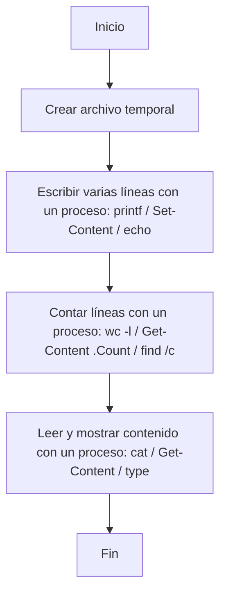

import Tabs from '@theme/Tabs';
import TabItem from '@theme/TabItem';

# Tema 1: Fundamentos de la Programación Concurrente y Procesos

Esta unidad introducirá los conceptos fundamentales de la ejecución paralela y la gestión del sistema operativo sobre los programas.    

## Contenidos

1. Introducción a la Programación Concurrente y Paralela
    - Características de la programación concurrente y sus ámbitos. 
    - Diferencias entre programación paralela y distribuida: ventajas e inconvenientes.
2. Gestión de Procesos por el Sistema Operativo
    - Ejecutables: procesos y servicios. 
    - Estados de un proceso y la planificación por el sistema operativo. 
    - Comandos y herramientas gráficas para la gestión de procesos (monitorización, finalización, etc.).
3. Programación con Procesos y Sincronización
    - Creación y gestión de procesos desde una aplicación. 
    - Comunicación entre procesos (pipes, sockets -breve introducción-, memoria compartida). 
    - Sincronización entre procesos. 
    - Programación de aplicaciones multiproceso sencillas.
4. Depuración y Documentación de Aplicaciones Multiproceso
    - Técnicas básicas de depuración para aplicaciones multiproceso. 
    - Importancia y métodos de documentación.

## Ejercicios prácticos

:::info
Los siguientes ejercicios están diseñados para practicar la gestión, creación, monitorización y manejo de procesos en Kotlin. Cada uno incluye una solución oculta que puedes consultar cuando lo necesites.
:::

:::tip Bash, PowerShell y CMD
Los enunciados usan comandos de bash (Linux, macOS, WSL o Git Bash), pero cada ejercicio indica también sus equivalentes en PowerShell y CMD, y las soluciones tienen una pestaña para cada intérprete (la pestaña que elijas se mantiene en todos los ejercicios). En Windows ten en cuenta que:

- `ProcessBuilder` no usa ningún intérprete: lanza directamente un ejecutable. Los comandos internos de CMD (`dir`, `echo`, `type`...) y los *cmdlets* de PowerShell (`Get-ChildItem`, `Get-Process`...) no son ejecutables, así que hay que lanzarlos a través de su intérprete: `cmd /c ...` o `powershell -Command ...`.
- Al lanzar `powershell` desde Java conviene cerrar su entrada estándar (`process.outputStream.close()`); si no, puede quedarse esperando datos y no terminar nunca.
- Si las tildes o la `ñ` aparecen mal, es por la codificación de la consola de Windows. Se arregla anteponiendo `chcp 65001 > nul &` en CMD o `[Console]::OutputEncoding = [Text.Encoding]::UTF8;` en PowerShell.
:::

### Ejercicio 1: Ejecutar un comando simple
**Enunciado:** Escribe un programa en Kotlin que ejecute el comando `ls` y muestre la salida por pantalla.

**Comandos:** bash `ls` · PowerShell `Get-ChildItem` · CMD `dir`

**Requisitos:**
- Usar `ProcessBuilder`.
- Mostrar la salida estándar del proceso.
<details>
<summary>Solución</summary>

<Tabs groupId="shell">
<TabItem value="bash" label="bash" default>

```kotlin title="Main.kt"
import java.io.BufferedReader
import java.io.InputStreamReader

fun main() {
    val process = ProcessBuilder("ls").start()
    val reader = BufferedReader(InputStreamReader(process.inputStream))
    reader.lines().forEach { println(it) }
}
```

</TabItem>
<TabItem value="powershell" label="PowerShell">

```kotlin title="Main.kt"
import java.io.BufferedReader
import java.io.InputStreamReader

fun main() {
    // Get-ChildItem es un cmdlet: se ejecuta dentro de powershell
    val process = ProcessBuilder("powershell", "-Command", "Get-ChildItem").start()
    process.outputStream.close() // Cerramos la entrada para que PowerShell no espere datos
    val reader = BufferedReader(InputStreamReader(process.inputStream))
    reader.lines().forEach { println(it) }
}
```

</TabItem>
<TabItem value="cmd" label="CMD">

```kotlin title="Main.kt"
import java.io.BufferedReader
import java.io.InputStreamReader

fun main() {
    // dir es un comando interno de CMD: se ejecuta dentro de cmd
    val process = ProcessBuilder("cmd", "/c", "dir").start()
    val reader = BufferedReader(InputStreamReader(process.inputStream))
    reader.lines().forEach { println(it) }
}
```

</TabItem>
</Tabs>
</details>

### Ejercicio 2: Ejecutar un proceso con argumentos
**Enunciado:** Modifica el ejercicio anterior para ejecutar el comando `ls -l` (listado detallado) y mostrar la salida.

**Comandos:** bash `ls -l` · PowerShell `Get-ChildItem | Format-List` · CMD `dir /q` (incluye el propietario de cada archivo)

**Requisitos:**
- Pasar argumentos al proceso.
<details>
<summary>Solución</summary>

<Tabs groupId="shell">
<TabItem value="bash" label="bash" default>

```kotlin title="Main.kt"
import java.io.BufferedReader
import java.io.InputStreamReader

fun main() {
    val process = ProcessBuilder("ls", "-l").start()
    val reader = BufferedReader(InputStreamReader(process.inputStream))
    reader.lines().forEach { println(it) }
}
```

</TabItem>
<TabItem value="powershell" label="PowerShell">

```kotlin title="Main.kt"
import java.io.BufferedReader
import java.io.InputStreamReader

fun main() {
    // Todo lo que va tras -Command es la orden que interpreta PowerShell
    val process = ProcessBuilder("powershell", "-Command", "Get-ChildItem | Format-List").start()
    process.outputStream.close()
    val reader = BufferedReader(InputStreamReader(process.inputStream))
    reader.lines().forEach { println(it) }
}
```

</TabItem>
<TabItem value="cmd" label="CMD">

```kotlin title="Main.kt"
import java.io.BufferedReader
import java.io.InputStreamReader

fun main() {
    val process = ProcessBuilder("cmd", "/c", "dir", "/q").start()
    val reader = BufferedReader(InputStreamReader(process.inputStream))
    reader.lines().forEach { println(it) }
}
```

</TabItem>
</Tabs>
</details>

### Ejercicio 3: Capturar errores del proceso
**Enunciado:** Escribe un programa que ejecute un comando inexistente y capture tanto la salida estándar como la de error.

**Comandos:** lanza el comando inexistente a través del intérprete: bash `bash -c comando_inexistente` · PowerShell `powershell -Command comando_inexistente` · CMD `cmd /c comando_inexistente`

**Requisitos:**
- Usar `redirectErrorStream(false)` y mostrar ambas salidas.
<details>
<summary>Solución</summary>

Lanzamos el comando a través del intérprete porque, si se pasa directamente a `ProcessBuilder`, `start()` lanza una `IOException` (el ejecutable no existe) y no llega a haber ninguna salida de error que leer. En cambio, el intérprete sí arranca y es él quien escribe el error en su salida de error.

<Tabs groupId="shell">
<TabItem value="bash" label="bash" default>

```kotlin title="Main.kt"
import java.io.BufferedReader
import java.io.InputStreamReader

fun main() {
    val pb = ProcessBuilder("bash", "-c", "comando_inexistente")
    pb.redirectErrorStream(false)
    val process = pb.start()
    val stdOut = BufferedReader(InputStreamReader(process.inputStream))
    val stdErr = BufferedReader(InputStreamReader(process.errorStream))
    println("Salida estándar:")
    stdOut.lines().forEach { println(it) }
    println("Salida de error:")
    stdErr.lines().forEach { println(it) }
}
```

</TabItem>
<TabItem value="powershell" label="PowerShell">

```kotlin title="Main.kt"
import java.io.BufferedReader
import java.io.InputStreamReader

fun main() {
    val pb = ProcessBuilder("powershell", "-Command", "comando_inexistente")
    pb.redirectErrorStream(false)
    val process = pb.start()
    process.outputStream.close()
    val stdOut = BufferedReader(InputStreamReader(process.inputStream))
    val stdErr = BufferedReader(InputStreamReader(process.errorStream))
    println("Salida estándar:")
    stdOut.lines().forEach { println(it) }
    println("Salida de error:")
    stdErr.lines().forEach { println(it) }
}
```

</TabItem>
<TabItem value="cmd" label="CMD">

```kotlin title="Main.kt"
import java.io.BufferedReader
import java.io.InputStreamReader

fun main() {
    val pb = ProcessBuilder("cmd", "/c", "comando_inexistente")
    pb.redirectErrorStream(false)
    val process = pb.start()
    val stdOut = BufferedReader(InputStreamReader(process.inputStream))
    val stdErr = BufferedReader(InputStreamReader(process.errorStream))
    println("Salida estándar:")
    stdOut.lines().forEach { println(it) }
    println("Salida de error:")
    stdErr.lines().forEach { println(it) }
}
```

</TabItem>
</Tabs>
</details>

### Ejercicio 4: Esperar a que termine un proceso
**Enunciado:** Escribe un programa que ejecute el comando `sleep 2` y muestre un mensaje antes y después de la espera.

**Comandos:** bash `sleep 2` · PowerShell `Start-Sleep -Seconds 2` · CMD `ping -n 3 127.0.0.1 > nul` (CMD no tiene un `sleep` que funcione desde Java; este truco espera unos 2 segundos)

**Requisitos:**
- Usar `waitFor()` para esperar la finalización.
<details>
<summary>Solución</summary>

<Tabs groupId="shell">
<TabItem value="bash" label="bash" default>

```kotlin title="Main.kt"
fun main() {
    println("Iniciando proceso...")
    val process = ProcessBuilder("sleep", "2").start()
    process.waitFor()
    println("Proceso finalizado.")
}
```

</TabItem>
<TabItem value="powershell" label="PowerShell">

```kotlin title="Main.kt"
fun main() {
    println("Iniciando proceso...")
    val process = ProcessBuilder("powershell", "-Command", "Start-Sleep -Seconds 2").start()
    process.outputStream.close()
    process.waitFor()
    println("Proceso finalizado.")
}
```

</TabItem>
<TabItem value="cmd" label="CMD">

El comando `timeout /t 2` de CMD necesita una consola interactiva y falla al lanzarlo desde Java, por eso usamos `ping`: hace un ping por segundo, así que `-n 3` tarda unos 2 segundos.

```kotlin title="Main.kt"
fun main() {
    println("Iniciando proceso...")
    val process = ProcessBuilder("cmd", "/c", "ping", "-n", "3", "127.0.0.1", ">", "nul").start()
    process.waitFor()
    println("Proceso finalizado.")
}
```

</TabItem>
</Tabs>
</details>

### Ejercicio 5: Listar procesos activos
**Enunciado:** Escribe un programa que ejecute el comando `ps` y muestre la lista de procesos activos.

**Comandos:** bash `ps` · PowerShell `Get-Process` · CMD `tasklist`

**Requisitos:**
- Leer y mostrar la salida del proceso.
<details>
<summary>Solución</summary>

<Tabs groupId="shell">
<TabItem value="bash" label="bash" default>

```kotlin title="Main.kt"
import java.io.BufferedReader
import java.io.InputStreamReader

fun main() {
    val process = ProcessBuilder("ps").start()
    val reader = BufferedReader(InputStreamReader(process.inputStream))
    reader.lines().forEach { println(it) }
}
```

</TabItem>
<TabItem value="powershell" label="PowerShell">

```kotlin title="Main.kt"
import java.io.BufferedReader
import java.io.InputStreamReader

fun main() {
    val process = ProcessBuilder("powershell", "-Command", "Get-Process").start()
    process.outputStream.close()
    val reader = BufferedReader(InputStreamReader(process.inputStream))
    reader.lines().forEach { println(it) }
}
```

</TabItem>
<TabItem value="cmd" label="CMD">

```kotlin title="Main.kt"
import java.io.BufferedReader
import java.io.InputStreamReader

fun main() {
    val process = ProcessBuilder("cmd", "/c", "tasklist").start()
    val reader = BufferedReader(InputStreamReader(process.inputStream))
    reader.lines().forEach { println(it) }
}
```

</TabItem>
</Tabs>
</details>

### Ejercicio 6: Lanzar varios procesos en paralelo
**Enunciado:** Escribe un programa que lance tres procesos que ejecuten `sleep 1`, `sleep 2` y `sleep 3` en paralelo y muestre cuándo termina cada uno.

**Comandos:** bash `sleep N` · PowerShell `Start-Sleep -Seconds N` · CMD `ping -n N+1 127.0.0.1 > nul`

> **Nota:** El uso de hilos (`thread`) se verá en detalle en el siguiente tema. Aquí se muestra como ejemplo avanzado para quien quiera explorar cómo lanzar procesos en paralelo desde Kotlin.

**Requisitos:**
- Usar hilos para lanzar los procesos en paralelo.
<details>
<summary>Solución</summary>

<Tabs groupId="shell">
<TabItem value="bash" label="bash" default>

```kotlin title="Main.kt"
import kotlin.concurrent.thread

fun main() {
    val comandos = listOf("1", "2", "3")
    val hilos = comandos.map { segundos ->
        thread {
            val process = ProcessBuilder("sleep", segundos).start()
            process.waitFor()
            println("Proceso sleep $segundos terminado")
        }
    }
    hilos.forEach { it.join() }
}
```

</TabItem>
<TabItem value="powershell" label="PowerShell">

Arrancar PowerShell tarda alrededor de un segundo, así que los tiempos reales serán algo mayores, pero el orden de finalización se mantiene.

```kotlin title="Main.kt"
import kotlin.concurrent.thread

fun main() {
    val comandos = listOf("1", "2", "3")
    val hilos = comandos.map { segundos ->
        thread {
            val process = ProcessBuilder("powershell", "-Command", "Start-Sleep -Seconds $segundos").start()
            process.outputStream.close()
            process.waitFor()
            println("Proceso Start-Sleep $segundos terminado")
        }
    }
    hilos.forEach { it.join() }
}
```

</TabItem>
<TabItem value="cmd" label="CMD">

```kotlin title="Main.kt"
import kotlin.concurrent.thread

fun main() {
    val comandos = listOf("1", "2", "3")
    val hilos = comandos.map { segundos ->
        thread {
            // N + 1 pings tardan unos N segundos
            val pings = (segundos.toInt() + 1).toString()
            val process = ProcessBuilder("cmd", "/c", "ping", "-n", pings, "127.0.0.1", ">", "nul").start()
            process.waitFor()
            println("Proceso de $segundos s terminado")
        }
    }
    hilos.forEach { it.join() }
}
```

</TabItem>
</Tabs>
</details>

### Ejercicio 7: Comunicación entre procesos
**Enunciado:** Escribe un programa que ejecute el comando `echo hola` y redirija su salida como entrada a otro proceso que ejecute `tr a-z A-Z` (convierte a mayúsculas).

**Comandos:** bash `echo hola` y `tr a-z A-Z` · PowerShell `Write-Output hola` y `$input | ForEach-Object { $_.ToUpper() }` · CMD `echo hola` y `findstr /n "^"` (CMD no tiene un comando para pasar a mayúsculas; `findstr /n` numera las líneas que recibe)

**Requisitos:**
- Usar streams para conectar procesos.
<details>
<summary>Solución</summary>

<Tabs groupId="shell">
<TabItem value="bash" label="bash" default>

```kotlin title="Main.kt"
import java.io.BufferedReader
import java.io.InputStreamReader

fun main() {
    val echo = ProcessBuilder("echo", "hola").start()
    val tr = ProcessBuilder("tr", "a-z", "A-Z").start()
    echo.inputStream.transferTo(tr.outputStream)
    tr.outputStream.close()
    val reader = BufferedReader(InputStreamReader(tr.inputStream))
    reader.lines().forEach { println(it) }
}
```

</TabItem>
<TabItem value="powershell" label="PowerShell">

En PowerShell, `$input` representa lo que llega por la entrada estándar. Los `$` de PowerShell se escapan con `\$` para que Kotlin no los interprete como plantillas de *string*.

```kotlin title="Main.kt"
import java.io.BufferedReader
import java.io.InputStreamReader

fun main() {
    val echo = ProcessBuilder("powershell", "-Command", "Write-Output hola").start()
    echo.outputStream.close()
    val upper = ProcessBuilder("powershell", "-Command", "\$input | ForEach-Object { \$_.ToUpper() }").start()
    echo.inputStream.transferTo(upper.outputStream)
    upper.outputStream.close()
    val reader = BufferedReader(InputStreamReader(upper.inputStream))
    reader.lines().forEach { println(it) }
}
```

</TabItem>
<TabItem value="cmd" label="CMD">

CMD no tiene ningún comando para convertir a mayúsculas, así que conectamos `echo` con `findstr /n "^"`, que numera cada línea que recibe (la salida será `1:hola`). Lo importante del ejercicio, conectar la salida de un proceso con la entrada de otro, es igual. `findstr` es un programa (no un comando interno), por eso se lanza sin `cmd /c`.

```kotlin title="Main.kt"
import java.io.BufferedReader
import java.io.InputStreamReader

fun main() {
    val echo = ProcessBuilder("cmd", "/c", "echo", "hola").start()
    val findstr = ProcessBuilder("findstr", "/n", "^").start()
    echo.inputStream.transferTo(findstr.outputStream)
    findstr.outputStream.close()
    val reader = BufferedReader(InputStreamReader(findstr.inputStream))
    reader.lines().forEach { println(it) }
}
```

</TabItem>
</Tabs>
</details>

### Ejercicio 8: Monitorizar el uso de CPU de un proceso
**Enunciado:** Escribe un programa que lance un proceso (por ejemplo, `yes > /dev/null`) y monitorice su uso de CPU durante 3 segundos usando el comando `ps`.

**Comandos:**
- bash: `yes > /dev/null` y `ps -p <pid> -o %cpu`
- PowerShell: `while ($true) {}` y `Get-Process -Id <pid> | Select-Object Id, CPU`
- CMD: `for /l %i in (0,0,1) do @rem` (bucle infinito) y `tasklist /v /fo list /fi "PID eq <pid>"`

**Requisitos:**
- Lanzar y monitorizar el proceso.
- Mostrar el uso de CPU.
<details>
<summary>Solución</summary>

<Tabs groupId="shell">
<TabItem value="bash" label="bash" default>

```kotlin title="Main.kt"
import java.io.BufferedReader
import java.io.InputStreamReader
import kotlin.concurrent.thread

fun main() {
    val process = ProcessBuilder("yes").redirectOutput(ProcessBuilder.Redirect.DISCARD).start()
    val pid = process.pid()
    repeat(3) {
        Thread.sleep(1000)
        val ps = ProcessBuilder("ps", "-p", "$pid", "-o", "%cpu").start()
        val reader = BufferedReader(InputStreamReader(ps.inputStream))
        reader.lines().forEach { println(it) }
    }
    process.destroy()
}
```

</TabItem>
<TabItem value="powershell" label="PowerShell">

La columna `CPU` de `Get-Process` es el tiempo total de CPU consumido (en segundos), no un porcentaje: si crece aproximadamente un segundo por cada segundo, el proceso está ocupando un núcleo completo.

```kotlin title="Main.kt"
import java.io.BufferedReader
import java.io.InputStreamReader

fun main() {
    // Bucle infinito que mantiene ocupada la CPU
    val process = ProcessBuilder("powershell", "-Command", "while (\$true) {}")
        .redirectOutput(ProcessBuilder.Redirect.DISCARD)
        .start()
    process.outputStream.close()
    val pid = process.pid()
    repeat(3) {
        Thread.sleep(1000)
        val ps = ProcessBuilder("powershell", "-Command", "Get-Process -Id $pid | Select-Object Id, CPU").start()
        ps.outputStream.close()
        val reader = BufferedReader(InputStreamReader(ps.inputStream))
        reader.lines().forEach { println(it) }
    }
    process.destroy()
}
```

</TabItem>
<TabItem value="cmd" label="CMD">

`tasklist` tampoco muestra un porcentaje, sino el campo `Tiempo de CPU` acumulado (h:mm:ss), que irá aumentando mientras el bucle se ejecuta.

```kotlin title="Main.kt"
import java.io.BufferedReader
import java.io.InputStreamReader

fun main() {
    // for /l con incremento 0 es un bucle infinito que mantiene ocupada la CPU
    val process = ProcessBuilder("cmd", "/c", "for", "/l", "%i", "in", "(0,0,1)", "do", "@rem")
        .redirectOutput(ProcessBuilder.Redirect.DISCARD)
        .start()
    val pid = process.pid()
    repeat(3) {
        Thread.sleep(1000)
        val tasklist = ProcessBuilder("cmd", "/c", "tasklist", "/v", "/fo", "list", "/fi", "PID eq $pid").start()
        val reader = BufferedReader(InputStreamReader(tasklist.inputStream))
        reader.lines().forEach { println(it) }
    }
    process.destroy()
}
```

</TabItem>
</Tabs>
</details>

### Ejercicio 9: Crear un proceso hijo que ejecute otro programa Kotlin
**Enunciado:** Escribe dos programas Kotlin: el primero debe lanzar el segundo como proceso hijo y mostrar su salida.
**Requisitos:**
- El programa hijo debe estar compilado previamente como un `.jar` ejecutable.
- El lanzador debe mostrar la salida del hijo y su código de salida.
<details>
<summary>Solución</summary>

```kotlin title="Hijo.kt"
fun main() {
    println("¡Hola desde el proceso hijo!")
}
```

Compilamos el hijo como un `.jar` que incluya el runtime de Kotlin (también se puede generar desde IntelliJ o con Gradle):

```bash
kotlinc Hijo.kt -include-runtime -d hijo.jar
```

```kotlin title="Lanzador.kt"
fun main() {
    // El proceso hijo es una nueva JVM que ejecuta hijo.jar
    val process = ProcessBuilder("java", "-jar", "hijo.jar")
        .redirectErrorStream(true)
        .start()

    process.inputStream.bufferedReader().lines().forEach { println("[hijo] $it") }
    println("El hijo terminó con código ${process.waitFor()}")
}
```

Tanto el comando de compilación como el lanzador funcionan igual en bash, PowerShell y CMD, porque `kotlinc` y `java` son programas y no comandos internos del intérprete.
</details>

### Ejercicio 10: Logging y depuración en procesos concurrentes
**Enunciado:** Escribe un programa que lance varios hilos, cada uno de los cuales escribe mensajes en un log usando `java.util.logging`.

> **Nota:** El uso de hilos (`thread`) para simular procesos concurrentes se estudiará en profundidad en el siguiente tema. Este ejercicio se incluye como ejemplo avanzado para quien quiera experimentar.

**Requisitos:**
- Usar logging y simular procesos concurrentes.
<details>
<summary>Solución</summary>

```kotlin title="Main.kt"
import java.util.logging.FileHandler
import java.util.logging.Logger
import java.util.logging.SimpleFormatter
import kotlin.concurrent.thread

fun main() {
    val logger = Logger.getLogger("MyLogger")
    val fileHandler = FileHandler("app.log", true)
    fileHandler.formatter = SimpleFormatter()
    logger.addHandler(fileHandler)

    repeat(5) { i ->
        thread {
            logger.info("Iniciando proceso $i")
            Thread.sleep((1000..3000).random().toLong())
            logger.info("Finalizando proceso $i")

        }
    }
}
```
</details>

---

### Ejercicio 11: Prueba unitaria con JUnit para un proceso
**Enunciado:** Escribe una función en Kotlin que ejecute un comando y devuelva su salida como String. Implementa una prueba unitaria con JUnit que verifique que al ejecutar `echo hola` la salida es "hola".

**Comandos:** bash `echo hola` · PowerShell `Write-Output hola` · CMD `echo hola`

**Requisitos:**
- Usar JUnit 5.
- Proveer la función y la prueba.
<details>
<summary>Solución</summary>

<Tabs groupId="shell">
<TabItem value="bash" label="bash" default>

```kotlin title="ProcessUtils.kt"
import java.io.BufferedReader
import java.io.InputStreamReader

fun runCommand(vararg cmd: String): String {
    val process = ProcessBuilder(*cmd).start()
    val reader = BufferedReader(InputStreamReader(process.inputStream))
    return reader.readText().trim()
}
```

```kotlin title="ProcessUtilsTest.kt"
import org.junit.jupiter.api.Assertions.assertEquals
import org.junit.jupiter.api.Test

class ProcessUtilsTest {
    @Test
    fun testEcho() {
        val output = runCommand("echo", "hola")
        assertEquals("hola", output)
    }
}
```

</TabItem>
<TabItem value="powershell" label="PowerShell">

```kotlin title="ProcessUtils.kt"
import java.io.BufferedReader
import java.io.InputStreamReader

fun runCommand(vararg cmd: String): String {
    val process = ProcessBuilder(*cmd).start()
    process.outputStream.close() // Evita que PowerShell se quede esperando entrada
    val reader = BufferedReader(InputStreamReader(process.inputStream))
    return reader.readText().trim()
}
```

```kotlin title="ProcessUtilsTest.kt"
import org.junit.jupiter.api.Assertions.assertEquals
import org.junit.jupiter.api.Test

class ProcessUtilsTest {
    @Test
    fun testEcho() {
        val output = runCommand("powershell", "-Command", "Write-Output hola")
        assertEquals("hola", output)
    }
}
```

</TabItem>
<TabItem value="cmd" label="CMD">

`trim()` también elimina el salto de línea de Windows (`\r\n`) que añade `echo`.

```kotlin title="ProcessUtils.kt"
import java.io.BufferedReader
import java.io.InputStreamReader

fun runCommand(vararg cmd: String): String {
    val process = ProcessBuilder(*cmd).start()
    val reader = BufferedReader(InputStreamReader(process.inputStream))
    return reader.readText().trim()
}
```

```kotlin title="ProcessUtilsTest.kt"
import org.junit.jupiter.api.Assertions.assertEquals
import org.junit.jupiter.api.Test

class ProcessUtilsTest {
    @Test
    fun testEcho() {
        val output = runCommand("cmd", "/c", "echo", "hola")
        assertEquals("hola", output)
    }
}
```

</TabItem>
</Tabs>
</details>

### Ejercicio 12: Prueba unitaria con MockK para simular un proceso
**Enunciado:** Simula el comportamiento de una función que ejecuta un proceso usando MockK, comprobando que se llama correctamente y devuelve el resultado esperado.
**Requisitos:**
- Usar MockK para simular la función.
- Proveer la función y la prueba.
<details>
<summary>Solución</summary>

```kotlin title="ProcessRunner.kt"
fun runProcess(cmd: String): String {
    // Imaginemos que ejecuta un proceso real
    return "resultado real"
}
```

```kotlin title="ProcessRunnerTest.kt"
import io.mockk.every
import io.mockk.mockkStatic
import io.mockk.unmockkAll
import io.mockk.verify
import org.junit.jupiter.api.AfterEach
import org.junit.jupiter.api.Assertions.assertEquals
import org.junit.jupiter.api.Test

class ProcessRunnerTest {
    @AfterEach
    fun tearDown() = unmockkAll()

    @Test
    fun testRunProcessMock() {
        // Las funciones de nivel superior se compilan como métodos estáticos,
        // por eso se simulan con mockkStatic
        mockkStatic(::runProcess)
        every { runProcess("test") } returns "mockeado"

        val result = runProcess("test")

        assertEquals("mockeado", result)
        verify(exactly = 1) { runProcess("test") }
    }
}
```
</details>

### Ejercicio 13: Prueba de integración de procesos
**Enunciado:** Escribe un programa que cree un archivo temporal, escriba texto en él usando un proceso (`echo`), y luego lea el contenido con otro proceso (`cat`). Implementa una prueba de integración que verifique el flujo completo.

**Comandos:** bash `echo` y `cat` · PowerShell `Write-Output` y `Get-Content` · CMD `echo` y `type`

**Requisitos:**
- Crear archivo temporal, escribir y leer usando procesos.
- Proveer la prueba de integración.
<details>
<summary>Solución</summary>

<Tabs groupId="shell">
<TabItem value="bash" label="bash" default>

```kotlin title="IntegrationTest.kt"
import org.junit.jupiter.api.Assertions.assertEquals
import org.junit.jupiter.api.Test
import java.io.File

class IntegrationTest {
    @Test
    fun testProcessIntegration() {
        val temp = File.createTempFile("test", ".txt")
        ProcessBuilder("echo", "hola mundo").redirectOutput(temp).start().waitFor()
        val process = ProcessBuilder("cat", temp.absolutePath).start()
        val output = process.inputStream.bufferedReader().readText().trim()
        assertEquals("hola mundo", output)
        temp.delete()
    }
}
```

</TabItem>
<TabItem value="powershell" label="PowerShell">

La ruta va entre comillas simples dentro de la orden de PowerShell por si contiene espacios (por ejemplo, si el nombre de usuario los tiene).

```kotlin title="IntegrationTest.kt"
import org.junit.jupiter.api.Assertions.assertEquals
import org.junit.jupiter.api.Test
import java.io.File

class IntegrationTest {
    @Test
    fun testProcessIntegration() {
        val temp = File.createTempFile("test", ".txt")
        val escritor = ProcessBuilder("powershell", "-Command", "Write-Output 'hola mundo'")
            .redirectOutput(temp)
            .start()
        escritor.outputStream.close()
        escritor.waitFor()
        val lector = ProcessBuilder("powershell", "-Command", "Get-Content -LiteralPath '${temp.absolutePath}'").start()
        lector.outputStream.close()
        val output = lector.inputStream.bufferedReader().readText().trim()
        assertEquals("hola mundo", output)
        temp.delete()
    }
}
```

</TabItem>
<TabItem value="cmd" label="CMD">

En CMD pasamos `hola` y `mundo` como argumentos separados: si se pasa `"hola mundo"` como uno solo, Java lo entrecomilla y `echo` escribiría también las comillas.

```kotlin title="IntegrationTest.kt"
import org.junit.jupiter.api.Assertions.assertEquals
import org.junit.jupiter.api.Test
import java.io.File

class IntegrationTest {
    @Test
    fun testProcessIntegration() {
        val temp = File.createTempFile("test", ".txt")
        ProcessBuilder("cmd", "/c", "echo", "hola", "mundo").redirectOutput(temp).start().waitFor()
        val process = ProcessBuilder("cmd", "/c", "type", temp.absolutePath).start()
        val output = process.inputStream.bufferedReader().readText().trim()
        assertEquals("hola mundo", output)
        temp.delete()
    }
}
```

</TabItem>
</Tabs>
</details>


### Ejercicio 14: Prueba de integración de procesamiento encadenado
**Enunciado:** Escribe una función que reciba una lista de cadenas, las pase a un proceso que las convierta a mayúsculas (`tr a-z A-Z`), y luego a otro proceso que invierta el texto (`rev`). Implementa una prueba de integración que verifique el resultado para varias entradas.

**Comandos:**
- bash: `tr a-z A-Z` y `rev`
- PowerShell: `$input | ForEach-Object { $_.ToUpper() }` y `$input | ForEach-Object { $c = $_.ToCharArray(); [array]::Reverse($c); -join $c }`
- CMD: no tiene comandos para pasar a mayúsculas ni invertir texto (ver la solución)

**Requisitos:**
- Procesar varias cadenas usando dos procesos en cadena.
- Proveer función y prueba de integración.
<details>
<summary>Solución</summary>

<Tabs groupId="shell">
<TabItem value="bash" label="bash" default>

```kotlin title="ProcessChain.kt"
fun processStrings(inputs: List<String>): List<String> {
    return inputs.map { input ->
        val tr = ProcessBuilder("tr", "a-z", "A-Z").start()
        tr.outputStream.bufferedWriter().use { it.write(input); it.flush(); tr.outputStream.close() }
        val rev = ProcessBuilder("rev").start()
        tr.inputStream.transferTo(rev.outputStream)
        rev.outputStream.close()
        return@map rev.inputStream.bufferedReader().readText().trim()
    }
}
```

```kotlin title="ProcessChainTest.kt"
import org.junit.jupiter.api.Assertions.assertEquals
import org.junit.jupiter.api.Test

class ProcessChainTest {
    @Test
    fun testProcessStrings() {
        val result = processStrings(listOf("hola", "kotlin"))
        assertEquals(listOf("ALOH", "NILTOK"), result)
    }
}
```

</TabItem>
<TabItem value="powershell" label="PowerShell">

Cada proceso es un PowerShell que lee su entrada estándar con `$input`. Como arrancar PowerShell tarda alrededor de un segundo, la prueba tardará unos segundos en completarse.

```kotlin title="ProcessChain.kt"
fun processStrings(inputs: List<String>): List<String> {
    return inputs.map { input ->
        val upper = ProcessBuilder("powershell", "-Command",
            "\$input | ForEach-Object { \$_.ToUpper() }").start()
        upper.outputStream.bufferedWriter().use { it.write(input); it.flush(); upper.outputStream.close() }
        val rev = ProcessBuilder("powershell", "-Command",
            "\$input | ForEach-Object { \$c = \$_.ToCharArray(); [array]::Reverse(\$c); -join \$c }").start()
        upper.inputStream.transferTo(rev.outputStream)
        rev.outputStream.close()
        return@map rev.inputStream.bufferedReader().readText().trim()
    }
}
```

```kotlin title="ProcessChainTest.kt"
import org.junit.jupiter.api.Assertions.assertEquals
import org.junit.jupiter.api.Test

class ProcessChainTest {
    @Test
    fun testProcessStrings() {
        val result = processStrings(listOf("hola", "kotlin"))
        assertEquals(listOf("ALOH", "NILTOK"), result)
    }
}
```

</TabItem>
<TabItem value="cmd" label="CMD">

CMD no dispone de comandos para convertir a mayúsculas ni para invertir texto, así que este ejercicio no tiene una versión solo con CMD. Desde Windows puedes resolverlo con la versión de PowerShell o ejecutar la versión de bash en WSL.

</TabItem>
</Tabs>
</details>


### Ejercicio 15: Documentar el flujo de un programa multiproceso con validación
**Enunciado:** Escribe un programa que cree un archivo temporal, escriba varias líneas en él usando un proceso, luego use otro proceso para contar las líneas (`wc -l`), y finalmente lea y muestre el contenido. Documenta detalladamente el flujo del programa usando comentarios y un diagrama de flujo.

**Comandos:**
- bash: `printf` (escribir), `wc -l` (contar) y `cat` (leer)
- PowerShell: `Set-Content` (escribir), `(Get-Content ...).Count` (contar) y `Get-Content` (leer)
- CMD: `echo` (escribir), `type ... | find /c /v ""` (contar) y `type` (leer)

**Requisitos:**
- Documentar el código y el flujo.
- Incluir un diagrama de flujo.
<details>
<summary>Solución</summary>

<Tabs groupId="shell">
<TabItem value="bash" label="bash" default>

```kotlin title="FlujoMultiproceso.kt"
import java.io.File

fun main() {
    // 1. Crear archivo temporal
    val temp = File.createTempFile("flujo", ".txt")
    // 2. Escribir varias líneas usando un proceso
    val lines = listOf("primera línea", "segunda línea", "tercera línea")
    // printf repite el formato "%s\n" para cada argumento: una línea por elemento
    ProcessBuilder("printf", "%s\\n", *lines.toTypedArray())
        .redirectOutput(temp)
        .start()
        .waitFor()
    // 3. Contar líneas usando wc -l
    val wc = ProcessBuilder("wc", "-l", temp.absolutePath).start()
    val numLines = wc.inputStream.bufferedReader().readText().trim()
    println("Número de líneas: $numLines")
    // 4. Leer y mostrar el contenido
    val cat = ProcessBuilder("cat", temp.absolutePath).start()
    val contenido = cat.inputStream.bufferedReader().readText().trim()
    println("Contenido:\n$contenido")
    temp.delete()
}
```

</TabItem>
<TabItem value="powershell" label="PowerShell">

Como los tres pasos lanzan PowerShell, agrupamos en una función el arranque del proceso, el cierre de su entrada y la lectura de su salida.

```kotlin title="FlujoMultiproceso.kt"
import java.io.File

// Ejecuta una orden de PowerShell en un proceso nuevo y devuelve su salida
fun powershell(orden: String): String {
    val process = ProcessBuilder("powershell", "-Command", orden).start()
    process.outputStream.close() // Evita que PowerShell se quede esperando entrada
    return process.inputStream.bufferedReader().readText().trim()
}

fun main() {
    // 1. Crear archivo temporal
    val temp = File.createTempFile("flujo", ".txt")
    val ruta = temp.absolutePath
    // 2. Escribir varias líneas usando un proceso
    val lines = listOf("primera línea", "segunda línea", "tercera línea")
    // Set-Content escribe cada elemento de la lista 'a','b','c' en una línea
    val valores = lines.joinToString(",") { "'$it'" }
    powershell("Set-Content -LiteralPath '$ruta' -Encoding UTF8 -Value $valores")
    // 3. Contar líneas: Get-Content devuelve una lista de líneas y .Count su tamaño
    val numLines = powershell("(Get-Content -LiteralPath '$ruta').Count")
    println("Número de líneas: $numLines")
    // 4. Leer y mostrar el contenido
    val contenido = powershell("Get-Content -LiteralPath '$ruta' -Encoding UTF8")
    println("Contenido:\n$contenido")
    temp.delete()
}
```

</TabItem>
<TabItem value="cmd" label="CMD">

`find /c /v ""` cuenta las líneas que no coinciden con la cadena vacía, es decir, todas: es el equivalente habitual de `wc -l` en CMD.

```kotlin title="FlujoMultiproceso.kt"
import java.io.File

fun main() {
    // 1. Crear archivo temporal
    val temp = File.createTempFile("flujo", ".txt")
    val ruta = temp.absolutePath
    // 2. Escribir varias líneas usando un proceso
    val lines = listOf("primera línea", "segunda línea", "tercera línea")
    // Genera (echo primera línea& echo segunda línea& echo tercera línea):
    // cada echo escribe una línea y & los encadena en el mismo proceso cmd
    val ordenEcho = lines.joinToString("& ", "(", ")") { "echo $it" }
    ProcessBuilder("cmd", "/c", ordenEcho)
        .redirectOutput(temp)
        .start()
        .waitFor()
    // 3. Contar líneas con type ... | find /c /v ""
    val find = ProcessBuilder("cmd", "/c", "type", ruta, "|", "find", "/c", "/v", "\"\"").start()
    val numLines = find.inputStream.bufferedReader().readText().trim()
    println("Número de líneas: $numLines")
    // 4. Leer y mostrar el contenido
    val type = ProcessBuilder("cmd", "/c", "type", ruta).start()
    val contenido = type.inputStream.bufferedReader().readText().trim()
    println("Contenido:\n$contenido")
    temp.delete()
}
```

</TabItem>
</Tabs>

El flujo es el mismo en las tres versiones; solo cambian los comandos de cada paso:


```mermaid
flowchart TD
    A[Inicio] --> B[Crear archivo temporal]
    B --> C[Escribir varias líneas con un proceso: printf / Set-Content / echo]
    C --> D[Contar líneas con un proceso: wc -l / Get-Content .Count / find /c]
    D --> E[Leer y mostrar contenido con un proceso: cat / Get-Content / type]
    E --> F[Fin]
```
</details>

---

### Ejercicio 16: Menú interactivo de gestión de procesos con logging
**Enunciado:** Implementa un programa en Kotlin que muestre un menú de opciones para:
- Ejecutar un comando en primer plano y mostrar su salida
- Ejecutar un comando en segundo plano (sin bloquear el menú)
- Listar procesos lanzados en segundo plano
- Finalizar un proceso en segundo plano
El programa debe registrar todas las acciones en un log (`java.util.logging`).

**Comandos para probar:** bash `ls -l`, `sleep 30` · PowerShell `Get-ChildItem`, `Start-Sleep 30` · CMD `dir`, `ping -n 30 127.0.0.1`

**Requisitos:**
- Menú interactivo por consola
- Gestión de procesos en primer y segundo plano
- Logging de todas las acciones
<details>
<summary>Solución</summary>

<Tabs groupId="shell">
<TabItem value="bash" label="bash" default>

```kotlin title="MenuProcesos.kt"
import java.util.*
import java.util.logging.FileHandler
import java.util.logging.Logger
import java.util.logging.SimpleFormatter
import kotlin.concurrent.thread

fun main() {
    val logger = Logger.getLogger("MenuProcesos")
    val fileHandler = FileHandler("procesos.log", true)
    fileHandler.formatter = SimpleFormatter()
    logger.addHandler(fileHandler)
    val bgProcesses = mutableMapOf<Int, Process>()
    val scanner = Scanner(System.`in`)
    var running = true
    while (running) {
        println("\nMenú de procesos:")
        println("1. Ejecutar comando en primer plano")
        println("2. Ejecutar comando en segundo plano")
        println("3. Listar procesos en segundo plano")
        println("4. Finalizar proceso en segundo plano")
        println("5. Salir")
        print("Opción: ")
        when (scanner.nextLine().trim()) {
            "1" -> {
                print("Comando: ")
                val cmd = scanner.nextLine().split(" ")
                val process = ProcessBuilder(cmd).start()
                logger.info("Ejecutando en primer plano: ${cmd.joinToString(" ")}")
                process.inputStream.bufferedReader().lines().forEach { println(it) }
                process.waitFor()
            }
            "2" -> {
                print("Comando: ")
                val cmd = scanner.nextLine().split(" ")
                val process = ProcessBuilder(cmd).start()
                val pid = process.pid().toInt()
                bgProcesses[pid] = process
                logger.info("Ejecutando en segundo plano (PID $pid): ${cmd.joinToString(" ")}")
                println("Lanzado en segundo plano con PID $pid")
            }
            "3" -> {
                println("Procesos en segundo plano:")
                bgProcesses.forEach { (pid, proc) ->
                    println("PID $pid - Vivo: ${proc.isAlive}")
                }
            }
            "4" -> {
                print("PID a finalizar: ")
                val pid = scanner.nextLine().toIntOrNull()
                if (pid != null && bgProcesses.containsKey(pid)) {
                    bgProcesses[pid]?.destroy()
                    logger.info("Finalizado proceso en segundo plano PID $pid")
                    println("Proceso $pid finalizado")
                    bgProcesses.remove(pid)
                } else {
                    println("PID no válido")
                }
            }
            "5" -> {
                running = false
                logger.info("Menú finalizado por el usuario")
            }
            else -> println("Opción no válida")
        }
    }
    // Finalizar procesos en segundo plano al salir
    bgProcesses.values.forEach { it.destroy() }
}
```

</TabItem>
<TabItem value="powershell" label="PowerShell">

Cada comando se ejecuta dentro de un proceso `powershell`, así que el PID que se guarda es el de ese PowerShell. Si la orden lanza a su vez otro programa (por ejemplo, `ping`), este será un proceso hijo, por eso al finalizar se destruyen también sus descendientes (`descendants()`).

```kotlin title="MenuProcesos.kt"
import java.util.*
import java.util.logging.FileHandler
import java.util.logging.Logger
import java.util.logging.SimpleFormatter

// Finaliza el proceso y todos los procesos que haya lanzado
fun finalizar(process: Process) {
    process.descendants().forEach { it.destroy() }
    process.destroy()
}

fun main() {
    val logger = Logger.getLogger("MenuProcesos")
    val fileHandler = FileHandler("procesos.log", true)
    fileHandler.formatter = SimpleFormatter()
    logger.addHandler(fileHandler)
    val bgProcesses = mutableMapOf<Int, Process>()
    val scanner = Scanner(System.`in`)
    var running = true
    while (running) {
        println("\nMenú de procesos:")
        println("1. Ejecutar comando en primer plano")
        println("2. Ejecutar comando en segundo plano")
        println("3. Listar procesos en segundo plano")
        println("4. Finalizar proceso en segundo plano")
        println("5. Salir")
        print("Opción: ")
        when (scanner.nextLine().trim()) {
            "1" -> {
                print("Comando: ")
                // PowerShell recibe la línea completa y la interpreta él mismo
                val cmd = scanner.nextLine()
                val process = ProcessBuilder("powershell", "-Command", cmd).start()
                process.outputStream.close()
                logger.info("Ejecutando en primer plano: $cmd")
                process.inputStream.bufferedReader().lines().forEach { println(it) }
                process.waitFor()
            }
            "2" -> {
                print("Comando: ")
                val cmd = scanner.nextLine()
                val process = ProcessBuilder("powershell", "-Command", cmd).start()
                process.outputStream.close()
                val pid = process.pid().toInt()
                bgProcesses[pid] = process
                logger.info("Ejecutando en segundo plano (PID $pid): $cmd")
                println("Lanzado en segundo plano con PID $pid")
            }
            "3" -> {
                println("Procesos en segundo plano:")
                bgProcesses.forEach { (pid, proc) ->
                    println("PID $pid - Vivo: ${proc.isAlive}")
                }
            }
            "4" -> {
                print("PID a finalizar: ")
                val pid = scanner.nextLine().toIntOrNull()
                if (pid != null && bgProcesses.containsKey(pid)) {
                    bgProcesses[pid]?.let { finalizar(it) }
                    logger.info("Finalizado proceso en segundo plano PID $pid")
                    println("Proceso $pid finalizado")
                    bgProcesses.remove(pid)
                } else {
                    println("PID no válido")
                }
            }
            "5" -> {
                running = false
                logger.info("Menú finalizado por el usuario")
            }
            else -> println("Opción no válida")
        }
    }
    // Finalizar procesos en segundo plano al salir
    bgProcesses.values.forEach { finalizar(it) }
}
```

</TabItem>
<TabItem value="cmd" label="CMD">

Cada comando se ejecuta dentro de un proceso `cmd`, así que el PID que se guarda es el de ese CMD. Si el comando es un programa (por ejemplo, `ping`), este será un proceso hijo de `cmd`, por eso al finalizar se destruyen también sus descendientes (`descendants()`).

```kotlin title="MenuProcesos.kt"
import java.util.*
import java.util.logging.FileHandler
import java.util.logging.Logger
import java.util.logging.SimpleFormatter

// Finaliza el proceso y todos los procesos que haya lanzado
fun finalizar(process: Process) {
    process.descendants().forEach { it.destroy() }
    process.destroy()
}

fun main() {
    val logger = Logger.getLogger("MenuProcesos")
    val fileHandler = FileHandler("procesos.log", true)
    fileHandler.formatter = SimpleFormatter()
    logger.addHandler(fileHandler)
    val bgProcesses = mutableMapOf<Int, Process>()
    val scanner = Scanner(System.`in`)
    var running = true
    while (running) {
        println("\nMenú de procesos:")
        println("1. Ejecutar comando en primer plano")
        println("2. Ejecutar comando en segundo plano")
        println("3. Listar procesos en segundo plano")
        println("4. Finalizar proceso en segundo plano")
        println("5. Salir")
        print("Opción: ")
        when (scanner.nextLine().trim()) {
            "1" -> {
                print("Comando: ")
                val cmd = scanner.nextLine().split(" ")
                // cmd /c permite usar también comandos internos como dir
                val process = ProcessBuilder(listOf("cmd", "/c") + cmd).start()
                logger.info("Ejecutando en primer plano: ${cmd.joinToString(" ")}")
                process.inputStream.bufferedReader().lines().forEach { println(it) }
                process.waitFor()
            }
            "2" -> {
                print("Comando: ")
                val cmd = scanner.nextLine().split(" ")
                val process = ProcessBuilder(listOf("cmd", "/c") + cmd).start()
                val pid = process.pid().toInt()
                bgProcesses[pid] = process
                logger.info("Ejecutando en segundo plano (PID $pid): ${cmd.joinToString(" ")}")
                println("Lanzado en segundo plano con PID $pid")
            }
            "3" -> {
                println("Procesos en segundo plano:")
                bgProcesses.forEach { (pid, proc) ->
                    println("PID $pid - Vivo: ${proc.isAlive}")
                }
            }
            "4" -> {
                print("PID a finalizar: ")
                val pid = scanner.nextLine().toIntOrNull()
                if (pid != null && bgProcesses.containsKey(pid)) {
                    bgProcesses[pid]?.let { finalizar(it) }
                    logger.info("Finalizado proceso en segundo plano PID $pid")
                    println("Proceso $pid finalizado")
                    bgProcesses.remove(pid)
                } else {
                    println("PID no válido")
                }
            }
            "5" -> {
                running = false
                logger.info("Menú finalizado por el usuario")
            }
            else -> println("Opción no válida")
        }
    }
    // Finalizar procesos en segundo plano al salir
    bgProcesses.values.forEach { finalizar(it) }
}
```

</TabItem>
</Tabs>
</details>

