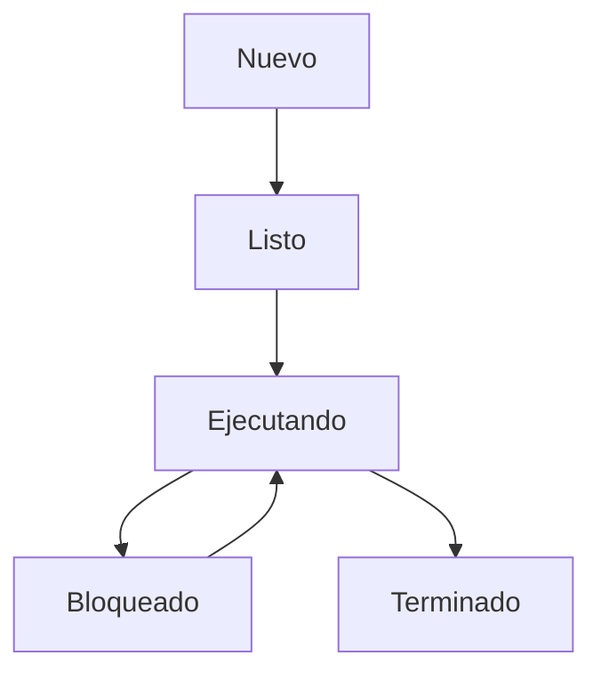

# Procesos y Subprocesos en Sistemas Operativos

Antes de seguir hablando de programación concurrente y entornos paralelos, es importante entender qué son los procesos y subprocesos en un sistema operativo.

## Procesos

Un proceso es un programa en ejecución, que incluye el código del programa, sus datos y su estado de ejecución. Los sistemas operativos modernos permiten la ejecución de múltiples procesos de manera concurrente, lo que significa que varios procesos pueden estar en ejecución al mismo tiempo.

En el contexto de un sistema operativo podemos hablar de la gestión de procesos, que incluye la creación, planificación y terminación de procesos.  

Un proceso a nivel de sistema operativo se refiere a una instancia de un programa en ejecución, que tiene su propio espacio de direcciones y recursos asignados.

Un mismo programa puede tener múltiples instancias en ejecución, cada una de las cuales se considera un proceso separado. Por ejemplo, un navegador web puede tener múltiples ventanas o pestañas abiertas, cada una de las cuales se ejecuta como un proceso independiente.    

En Windows podemos utilizar el Administrador de tareas para ver y gestionar los procesos en ejecución. Este herramienta nos permite ver información detallada sobre cada proceso, como su uso de CPU y memoria, y nos permite finalizar procesos que no responden.  

En sistemas Linux también podemos utilizar herramientas como `top` o `htop` para monitorizar y gestionar los procesos en ejecución. 

### Subprocesos

Los subprocesos, o hilos de ejecución, son unidades más pequeñas dentro de un proceso. Un proceso puede contener múltiples subprocesos que comparten el mismo espacio de direcciones y recursos, pero que se ejecutan de manera independiente. Esto permite una mayor eficiencia y una mejor utilización de los recursos del sistema.

Los subprocesos son especialmente útiles en aplicaciones que requieren realizar múltiples tareas simultáneamente, como servidores web que manejan múltiples conexiones de clientes al mismo tiempo. Al utilizar subprocesos, un servidor puede atender a varios clientes sin bloquearse en una sola tarea.

Los subprocesos también son utilizados en aplicaciones de procesamiento de datos, donde se pueden dividir tareas grandes en subtareas más pequeñas que se pueden ejecutar en paralelo. Esto puede mejorar significativamente el rendimiento y la capacidad de respuesta de la aplicación.

### Ejecutables: Procesos y Servicios

Cuando hablamos de procesos y subprocesos, también es importante mencionar los ejecutables y servicios en un sistema operativo. Un ejecutable es un archivo que contiene un programa que puede ser ejecutado por el sistema operativo. Cuando un ejecutable se inicia, se crea un nuevo proceso en el sistema.

Los servicios, por otro lado, son procesos en segundo plano que se ejecutan sin la intervención directa del usuario. Estos procesos suelen proporcionar funcionalidades esenciales al sistema operativo o a otras aplicaciones. Por ejemplo, un servicio de impresión puede gestionar las tareas de impresión en segundo plano, permitiendo que los usuarios sigan trabajando en otras tareas mientras se imprimen documentos.

En resumen, los procesos y subprocesos son fundamentales para la ejecución de programas en un sistema operativo, y los ejecutables y servicios son componentes clave en esta arquitectura.

### Estados de un proceso

Un proceso puede encontrarse en diferentes estados a lo largo de su ciclo de vida. Los estados más comunes son:

- **Nuevo**: El proceso está siendo creado.
- **Listo**: El proceso está preparado para ejecutarse y espera ser asignado a un procesador.
- **Ejecutando**: El proceso está en ejecución y utilizando el CPU.
- **Bloqueado**: El proceso está esperando un evento o recurso, como la finalización de una operación de entrada/salida.
- **Terminado**: El proceso ha finalizado su ejecución y ha liberado sus recursos.

Estos estados pueden variar ligeramente entre diferentes sistemas operativos, pero en general, representan el ciclo de vida de un proceso en un sistema operativo.

Podríamos representar las transiciones de un estado a otro de la siguiente forma:

