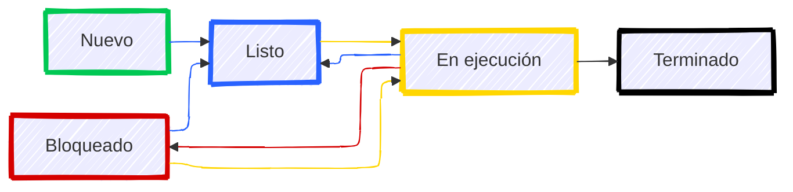

# Procesos y Subprocesos en Sistemas Operativos

Antes de seguir hablando de programación concurrente y entornos paralelos, es importante entender qué son los procesos y subprocesos en un sistema operativo.

## Procesos

Un proceso es un programa en ejecución, que incluye el código del programa, sus datos y su estado de ejecución. Los sistemas operativos modernos permiten la ejecución de múltiples procesos de manera concurrente, lo que significa que varios procesos pueden estar en ejecución al mismo tiempo.

En el contexto de un sistema operativo podemos hablar de la gestión de procesos, que incluye la creación, planificación y terminación de procesos.  

Un proceso a nivel de sistema operativo se refiere a una instancia de un programa en ejecución, que tiene su propio espacio de direcciones y recursos asignados.

Un mismo programa puede tener múltiples instancias en ejecución, cada una de las cuales se considera un proceso separado. Por ejemplo, un navegador web puede tener múltiples ventanas o pestañas abiertas, cada una de las cuales se ejecuta como un proceso independiente.    

En Windows podemos utilizar el Administrador de tareas para ver y gestionar los procesos en ejecución. Este herramienta nos permite ver información detallada sobre cada proceso, como su uso de CPU y memoria, y nos permite finalizar procesos que no responden.  

En sistemas Linux también podemos utilizar herramientas como `top` o `htop` para monitorizar y gestionar los procesos en ejecución. 

### Subprocesos

Los subprocesos, o hilos de ejecución, son unidades más pequeñas dentro de un proceso. Un proceso puede contener múltiples subprocesos que comparten el mismo espacio de direcciones y recursos, pero que se ejecutan de manera independiente. Esto permite una mayor eficiencia y una mejor utilización de los recursos del sistema.

Los subprocesos son especialmente útiles en aplicaciones que requieren realizar múltiples tareas simultáneamente, como servidores web que manejan múltiples conexiones de clientes al mismo tiempo. Al utilizar subprocesos, un servidor puede atender a varios clientes sin bloquearse en una sola tarea.

Los subprocesos también son utilizados en aplicaciones de procesamiento de datos, donde se pueden dividir tareas grandes en subtareas más pequeñas que se pueden ejecutar en paralelo. Esto puede mejorar significativamente el rendimiento y la capacidad de respuesta de la aplicación.

### Ejecutables: Procesos y Servicios

Cuando hablamos de procesos y subprocesos, también es importante mencionar los ejecutables y servicios en un sistema operativo. Un ejecutable es un archivo que contiene un programa que puede ser ejecutado por el sistema operativo. Cuando un ejecutable se inicia, se crea un nuevo proceso en el sistema.

Los servicios, por otro lado, son procesos en segundo plano que se ejecutan sin la intervención directa del usuario. Estos procesos suelen proporcionar funcionalidades esenciales al sistema operativo o a otras aplicaciones. Por ejemplo, un servicio de impresión puede gestionar las tareas de impresión en segundo plano, permitiendo que los usuarios sigan trabajando en otras tareas mientras se imprimen documentos.

En resumen, los procesos y subprocesos son fundamentales para la ejecución de programas en un sistema operativo, y los ejecutables y servicios son componentes clave en esta arquitectura.

### Estados de un proceso

Un proceso puede encontrarse en diferentes estados a lo largo de su ciclo de vida. Los estados más comunes son:

- **Nuevo**: El proceso está siendo creado.
- **Listo**: El proceso está preparado para ejecutarse y espera ser asignado a un procesador.
- **Ejecutando**: El proceso está en ejecución y utilizando el CPU.
- **Bloqueado**: El proceso está esperando un evento o recurso, como la finalización de una operación de entrada/salida.
- **Terminado**: El proceso ha finalizado su ejecución y ha liberado sus recursos.

Estos estados pueden variar ligeramente entre diferentes sistemas operativos, pero en general, representan el ciclo de vida de un proceso en un sistema operativo.

Podríamos representar las transiciones de un estado a otro de la siguiente forma:



### Algoritmos de planificación

Cuando varios procesos compiten por el mismo recurso, el sistema operativo debe decidir cuál de ellos obtiene acceso al recurso y por cuánto tiempo. Este proceso de toma de decisiones se conoce como planificación de procesos.

Existen varios algoritmos de planificación que se pueden utilizar, cada uno con sus propias ventajas y desventajas. Algunos de los algoritmos de planificación más comunes son:

- **FIFO (First In, First Out)**: Este algoritmo asigna el recurso al primer proceso que lo solicita. Es simple de implementar, pero puede llevar a tiempos de espera largos para procesos que llegan más tarde.

- **LIFO (Last In, First Out)**: Este algoritmo asigna el recurso al último proceso que lo solicitó. Es útil en situaciones donde los procesos más recientes son más importantes, pero puede llevar a la inanición de procesos más antiguos.

- **Round Robin**: Este algoritmo asigna un tiempo fijo de CPU a cada proceso en una cola. Cuando un proceso agota su tiempo, se coloca al final de la cola y se le asigna el CPU al siguiente proceso. Esto permite una mejor respuesta para procesos interactivos, pero puede ser ineficiente para procesos de larga duración.

- **Prioridad**: Este algoritmo asigna recursos a procesos en función de su prioridad. Los procesos de mayor prioridad obtienen acceso al recurso antes que los de menor prioridad. Esto puede llevar a la inanición de procesos de baja prioridad si siempre hay procesos de alta prioridad en la cola.

- **SJF (Shortest Job First)**: Este algoritmo asigna el recurso al proceso con el tiempo de ejecución más corto. Esto puede mejorar la eficiencia general del sistema, pero requiere conocer el tiempo de ejecución de los procesos de antemano, lo cual no siempre es posible.

- **Multilevel Queue**: Este algoritmo organiza los procesos en diferentes colas según su prioridad. Cada cola puede tener su propio algoritmo de planificación, lo que permite una mayor flexibilidad en la gestión de procesos.   

Cada uno de estos algoritmos tiene sus propias características y es adecuado para diferentes tipos de sistemas y cargas de trabajo. La elección del algoritmo de planificación adecuado es crucial para garantizar un rendimiento óptimo del sistema.

Un mismo proceso puede tener varias **ráfagas** de CPU, es decir, puede ser interrumpido y reanudado varias veces durante su ejecución. Las razones por las cuales un proceso puede necesitar un cierto tiempo de bloqueo pueden ser como que necesite realizar **operaciones de entrada/salida** o esperar la finalización de otro proceso.    

:::info El concepto de Quantum

El **quantum** es el tiempo máximo que un proceso puede utilizar el CPU antes de ser interrumpido y colocado de nuevo en la cola de listos. Este concepto es fundamental en algoritmos de planificación como Round Robin, donde se asigna un quantum fijo a cada proceso. La elección de un quantum adecuado es importante: un quantum muy corto puede llevar a una alta sobrecarga de conmutación de contexto, mientras que un quantum muy largo puede hacer que los procesos interactivos se sientan lentos.

Algunos algoritmos de planificación utilizan el concepto de quantum para gestionar el tiempo de CPU de manera más eficiente. Por ejemplo, en el algoritmo Round Robin, se asigna un quantum fijo a cada proceso, lo que garantiza que todos los procesos tengan la oportunidad de ejecutarse en un tiempo razonable. Esto es especialmente útil en sistemas interactivos, donde la capacidad de respuesta es crucial.   

:::

:::warning Algoritmos de planificación expropiativos o no expropiativos

Los algoritmos de planificación pueden ser **expropiativos** o **no expropiativos**. Los algoritmos expropiativos permiten que un proceso en ejecución sea interrumpido para dar paso a otro proceso de mayor prioridad. Por otro lado, los algoritmos no expropiativos no permiten que un proceso en ejecución sea interrumpido; debe completar su tiempo de CPU antes de que otro proceso pueda ejecutarse.   

:::

### Gestión y Monitorización de Procesos

Existen diversos programas y comandos para la gestión y monitorización de procesos en diferentes sistemas operativos. Algunos de los más comunes son:

- **Windows**: El Administrador de tareas permite ver y gestionar los procesos en ejecución. También se pueden utilizar comandos como `tasklist` y `taskkill` en la línea de comandos.

- **Linux**: Herramientas como `top`, `htop` y `ps` permiten monitorizar los procesos en tiempo real. Para gestionar procesos, se pueden utilizar comandos como `kill` y `nice`.

- **macOS**: El Monitor de Actividad proporciona una interfaz gráfica para gestionar procesos. También se pueden utilizar comandos similares a los de Linux en la terminal.

Estas herramientas son esenciales para los administradores de sistemas y los desarrolladores, ya que permiten identificar y resolver problemas relacionados con el rendimiento de los procesos.

#### Administrador de tareas

El administrador de tareas de Windows permite ver y gestionar los procesos en ejecución. Proporciona información sobre el uso de CPU, memoria y disco de cada proceso, así como la capacidad de finalizar procesos que no responden.

Además, permite cambiar la prioridad de los procesos y ver información detallada sobre el rendimiento del sistema.

En Windows 11 podemos observar mejoras en la interfaz del Administrador de tareas, incluyendo una vista más clara de los procesos en ejecución y su impacto en el rendimiento del sistema.

Además, se han añadido nuevas funcionalidades, como la posibilidad de agrupar procesos por aplicación y ver el uso de recursos de manera más detallada.

#### El comando ``tasklist``

Con el comando ``tasklist``podemos ver una lista de todos los procesos en ejecución en el sistema, junto con información detallada como el ID del proceso (PID), el nombre de la imagen y el uso de memoria.

Contiene las siguientes opciones: 

- **/s**: Muestra información sobre los procesos en todos los sistemas.
- **/fo**: Especifica el formato de salida (table, list, csv).
- **/v**: Muestra información detallada sobre los procesos.

##### Ejemplos de uso de ``tasklist``

Para ver todos los procesos en ejecución en el sistema, podemos utilizar el comando ``tasklist`` sin ninguna opción adicional:

```
tasklist
```

Esto mostrará una lista de todos los procesos en ejecución, junto con información como el PID y el uso de memoria.

Si queremos ver la información en un formato específico, podemos utilizar la opción ``/fo``. Por ejemplo, para obtener la lista en formato CSV, podemos ejecutar:

```
tasklist /fo csv
```

#### El comando ``taskkill``

Por otro lado, el comando ``taskkill`` nos permite finalizar un proceso en ejecución utilizando su PID o nombre de imagen. Esto es útil para cerrar aplicaciones que no responden o para liberar recursos del sistema.

También tiene las siguientes opciones:

- **/f**: Fuerza la finalización del proceso.
- **/t**: Finaliza el proceso y todos sus procesos secundarios.

##### Ejemplos de uso de ``taskkill``

Para finalizar un proceso utilizando su PID, podemos ejecutar el siguiente comando:

```
taskkill /pid <PID>
```

Donde `<PID>` es el ID del proceso que queremos finalizar.

Si queremos finalizar un proceso utilizando su nombre de imagen, podemos utilizar el siguiente comando:

```
taskkill /im <nombre_imagen>
```

Donde `<nombre_imagen>` es el nombre del proceso que queremos finalizar (por ejemplo, `notepad.exe`).

#### El comando ``top``en Linux

El comando ``top`` es una herramienta de monitorización en tiempo real que muestra los procesos en ejecución en un sistema Linux. Proporciona información sobre el uso de CPU, memoria y otros recursos del sistema.

##### Ejemplos de uso de ``top``

Para utilizar el comando ``top``, simplemente debemos escribir ``top`` en la terminal y presionar Enter:

```
top
```

Esto abrirá una interfaz en la terminal que se actualizará automáticamente para mostrar los procesos en ejecución.

Si queremos ver información más detallada sobre un proceso específico, podemos presionar la tecla ``h`` mientras estamos en la interfaz de ``top`` para ver la ayuda y las opciones disponibles.

#### El comando ``htop`` en Linux

El comando ``htop`` es una versión mejorada de ``top`` que proporciona una interfaz más amigable y fácil de usar para monitorizar los procesos en un sistema Linux. Ofrece características adicionales como la posibilidad de ordenar procesos, buscar procesos específicos y ver información detallada sobre el uso de recursos.

##### Ejemplos de uso de ``htop``

Para utilizar el comando ``htop``, simplemente debemos escribir ``htop`` en la terminal y presionar Enter:

```
htop
```

Esto abrirá una interfaz en la terminal que se actualizará automáticamente para mostrar los procesos en ejecución.

Si queremos ver información más detallada sobre un proceso específico, podemos utilizar las teclas de flecha para navegar por la lista de procesos y seleccionar el que nos interese.

Opciones adicionales de ``htop``:

- **F2**: Acceder al menú de configuración.
- **F3**: Buscar un proceso.
- **F4**: Filtrar procesos.
- **F5**: Ver la jerarquía de procesos.
- **F6**: Ordenar procesos por diferentes criterios.
- **F9**: Finalizar un proceso.

#### El comando ``ps``en Linux

El comando ``ps`` (process status) se utiliza para mostrar información sobre los procesos en ejecución en un sistema Linux. A diferencia de ``top`` y ``htop``, que muestran información en tiempo real, ``ps`` proporciona una instantánea de los procesos en el momento en que se ejecuta el comando.

##### Ejemplos de uso de ``ps``

Para ver una lista de los procesos en ejecución del usuario actual, podemos utilizar el siguiente comando:

```
ps
```

Si queremos ver información más detallada, podemos utilizar la opción ``-f`` para mostrar una lista completa de los procesos:

```
ps -f
```

Para ver todos los procesos en el sistema, incluidos los de otros usuarios, podemos utilizar la opción ``-e``:

```
ps -e
```

#### El comando ``kill``en Linux

El comando ``kill`` se utiliza para enviar señales a los procesos en ejecución, lo que permite finalizar o controlar su comportamiento. La señal más comúnmente utilizada es ``SIGTERM``, que solicita a un proceso que se termine de manera ordenada.

##### Ejemplos de uso de ``kill``

Para finalizar un proceso utilizando su PID, podemos ejecutar el siguiente comando:

```
kill <PID>
```

Donde `<PID>` es el ID del proceso que queremos finalizar.

Si queremos forzar la finalización de un proceso, podemos utilizar la opción ``-9`` para enviar la señal ``SIGKILL``:

```
kill -9 <PID>
```

Esto finalizará el proceso de inmediato, sin darle la oportunidad de realizar una limpieza.

#### El comando ``pkill`` en Linux

El comando ``pkill`` se utiliza para finalizar procesos en función de su nombre de imagen, en lugar de su PID. Esto puede ser útil cuando no conocemos el PID de un proceso, pero sí su nombre.

##### Ejemplos de uso de ``pkill``

Para finalizar un proceso utilizando su nombre de imagen, podemos ejecutar el siguiente comando:

```
pkill <nombre_imagen>
```

Donde `<nombre_imagen>` es el nombre del proceso que queremos finalizar (por ejemplo, `firefox`).

#### El comando ``killall`` en Linux

El comando ``killall`` se utiliza para finalizar todos los procesos que coinciden con un nombre de imagen específico. A diferencia de ``pkill``, que puede utilizarse para enviar señales a procesos específicos, ``killall`` finaliza todos los procesos que coinciden con el nombre proporcionado.

##### Ejemplos de uso de ``killall``

Para finalizar todos los procesos con un nombre de imagen específico, podemos ejecutar el siguiente comando:

```
killall <nombre_imagen>
```

Donde `<nombre_imagen>` es el nombre del proceso que queremos finalizar (por ejemplo, `firefox`).

#### El comando ``nice`` en Linux

El comando ``nice`` se utiliza para ejecutar un programa con una prioridad de CPU modificada. Permite aumentar o disminuir la prioridad de un proceso, lo que puede ser útil para gestionar la carga del sistema y garantizar que los procesos importantes reciban más recursos.

##### Ejemplos de uso de ``nice``

Para ejecutar un comando con una prioridad más baja, podemos utilizar el siguiente comando:

```
nice -n 10 <comando>
```

Donde `<comando>` es el comando que queremos ejecutar. En este caso, estamos estableciendo una prioridad de 10, lo que significa que el proceso tendrá menos prioridad que otros procesos en ejecución.

Si queremos ejecutar un comando con una prioridad más alta, podemos utilizar un valor negativo:

```
nice -n -5 <comando>
```

Esto aumentará la prioridad del proceso, permitiéndole acceder a más recursos del sistema.

#### El comando ``renice`` en Linux
El comando ``renice`` se utiliza para cambiar la prioridad de un proceso en ejecución. A diferencia de ``nice``, que establece la prioridad al iniciar un proceso, ``renice`` permite modificar la prioridad de un proceso ya existente.

##### Ejemplos de uso de ``renice``

Para cambiar la prioridad de un proceso en ejecución, podemos utilizar el siguiente comando:

```
renice <nuevo_nice> -p <PID>
```

Donde `<nuevo_nice>` es el nuevo valor de prioridad que queremos establecer (puede ser positivo o negativo) y `<PID>` es el ID del proceso cuyo valor de prioridad queremos cambiar.
Por ejemplo, para aumentar la prioridad de un proceso con PID 1234, podemos ejecutar:

```
renice -5 -p 1234
```
Esto establecerá la prioridad del proceso a -5, lo que le dará más acceso a los recursos del sistema.

### Otras herramientas gráficas

Además de las herramientas de línea de comandos mencionadas anteriormente, existen varias herramientas gráficas que facilitan la gestión y monitorización de procesos en diferentes sistemas operativos. Algunas de las más populares incluyen: 

- **Process Explorer (Windows)**: Es una herramienta avanzada de monitorización de procesos que proporciona información detallada sobre los procesos en ejecución, incluyendo sus dependencias y recursos utilizados. Es especialmente útil para diagnosticar problemas de rendimiento y seguridad.
- **System Monitor (Linux)**: Muchas distribuciones de Linux incluyen una herramienta gráfica de monitorización del sistema que permite ver y gestionar los procesos en ejecución. Estas herramientas suelen ofrecer funcionalidades similares a las de ``htop``, pero con una interfaz gráfica más amigable.
- **Activity Monitor (macOS)**: Es la herramienta gráfica de monitorización de procesos en macOS. Permite ver y gestionar los procesos en ejecución, así como monitorizar el uso de recursos del sistema como CPU, memoria y disco.

Estas herramientas gráficas son especialmente útiles para usuarios que prefieren una interfaz visual para gestionar los procesos en lugar de utilizar la línea de comandos. Proporcionan una manera intuitiva de monitorizar el rendimiento del sistema y resolver problemas relacionados con los procesos. 

