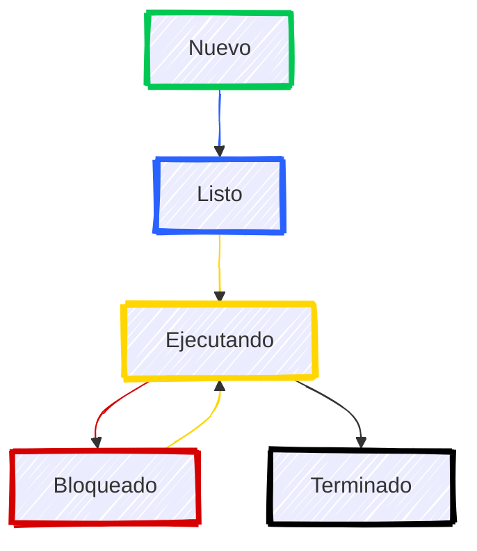

# Procesos y Subprocesos en Sistemas Operativos

Antes de seguir hablando de programación concurrente y entornos paralelos, es importante entender qué son los procesos y subprocesos en un sistema operativo.

## Procesos

Un proceso es un programa en ejecución, que incluye el código del programa, sus datos y su estado de ejecución. Los sistemas operativos modernos permiten la ejecución de múltiples procesos de manera concurrente, lo que significa que varios procesos pueden estar en ejecución al mismo tiempo.

En el contexto de un sistema operativo podemos hablar de la gestión de procesos, que incluye la creación, planificación y terminación de procesos.  

Un proceso a nivel de sistema operativo se refiere a una instancia de un programa en ejecución, que tiene su propio espacio de direcciones y recursos asignados.

Un mismo programa puede tener múltiples instancias en ejecución, cada una de las cuales se considera un proceso separado. Por ejemplo, un navegador web puede tener múltiples ventanas o pestañas abiertas, cada una de las cuales se ejecuta como un proceso independiente.    

En Windows podemos utilizar el Administrador de tareas para ver y gestionar los procesos en ejecución. Este herramienta nos permite ver información detallada sobre cada proceso, como su uso de CPU y memoria, y nos permite finalizar procesos que no responden.  

En sistemas Linux también podemos utilizar herramientas como `top` o `htop` para monitorizar y gestionar los procesos en ejecución. 

### Subprocesos

Los subprocesos, o hilos de ejecución, son unidades más pequeñas dentro de un proceso. Un proceso puede contener múltiples subprocesos que comparten el mismo espacio de direcciones y recursos, pero que se ejecutan de manera independiente. Esto permite una mayor eficiencia y una mejor utilización de los recursos del sistema.

Los subprocesos son especialmente útiles en aplicaciones que requieren realizar múltiples tareas simultáneamente, como servidores web que manejan múltiples conexiones de clientes al mismo tiempo. Al utilizar subprocesos, un servidor puede atender a varios clientes sin bloquearse en una sola tarea.

Los subprocesos también son utilizados en aplicaciones de procesamiento de datos, donde se pueden dividir tareas grandes en subtareas más pequeñas que se pueden ejecutar en paralelo. Esto puede mejorar significativamente el rendimiento y la capacidad de respuesta de la aplicación.

### Ejecutables: Procesos y Servicios

Cuando hablamos de procesos y subprocesos, también es importante mencionar los ejecutables y servicios en un sistema operativo. Un ejecutable es un archivo que contiene un programa que puede ser ejecutado por el sistema operativo. Cuando un ejecutable se inicia, se crea un nuevo proceso en el sistema.

Los servicios, por otro lado, son procesos en segundo plano que se ejecutan sin la intervención directa del usuario. Estos procesos suelen proporcionar funcionalidades esenciales al sistema operativo o a otras aplicaciones. Por ejemplo, un servicio de impresión puede gestionar las tareas de impresión en segundo plano, permitiendo que los usuarios sigan trabajando en otras tareas mientras se imprimen documentos.

En resumen, los procesos y subprocesos son fundamentales para la ejecución de programas en un sistema operativo, y los ejecutables y servicios son componentes clave en esta arquitectura.

### Estados de un proceso

Un proceso puede encontrarse en diferentes estados a lo largo de su ciclo de vida. Los estados más comunes son:

- **Nuevo**: El proceso está siendo creado.
- **Listo**: El proceso está preparado para ejecutarse y espera ser asignado a un procesador.
- **Ejecutando**: El proceso está en ejecución y utilizando el CPU.
- **Bloqueado**: El proceso está esperando un evento o recurso, como la finalización de una operación de entrada/salida.
- **Terminado**: El proceso ha finalizado su ejecución y ha liberado sus recursos.

Estos estados pueden variar ligeramente entre diferentes sistemas operativos, pero en general, representan el ciclo de vida de un proceso en un sistema operativo.

Podríamos representar las transiciones de un estado a otro de la siguiente forma:

### Algoritmos de planificación

Cuando varios procesos compiten por el mismo recurso, el sistema operativo debe decidir cuál de ellos obtiene acceso al recurso y por cuánto tiempo. Este proceso de toma de decisiones se conoce como planificación de procesos.

Existen varios algoritmos de planificación que se pueden utilizar, cada uno con sus propias ventajas y desventajas. Algunos de los algoritmos de planificación más comunes son:

- **FIFO (First In, First Out)**: Este algoritmo asigna el recurso al primer proceso que lo solicita. Es simple de implementar, pero puede llevar a tiempos de espera largos para procesos que llegan más tarde.

- **LIFO (Last In, First Out)**: Este algoritmo asigna el recurso al último proceso que lo solicitó. Es útil en situaciones donde los procesos más recientes son más importantes, pero puede llevar a la inanición de procesos más antiguos.

- **Round Robin**: Este algoritmo asigna un tiempo fijo de CPU a cada proceso en una cola. Cuando un proceso agota su tiempo, se coloca al final de la cola y se le asigna el CPU al siguiente proceso. Esto permite una mejor respuesta para procesos interactivos, pero puede ser ineficiente para procesos de larga duración.

- **Prioridad**: Este algoritmo asigna recursos a procesos en función de su prioridad. Los procesos de mayor prioridad obtienen acceso al recurso antes que los de menor prioridad. Esto puede llevar a la inanición de procesos de baja prioridad si siempre hay procesos de alta prioridad en la cola.

- **SJF (Shortest Job First)**: Este algoritmo asigna el recurso al proceso con el tiempo de ejecución más corto. Esto puede mejorar la eficiencia general del sistema, pero requiere conocer el tiempo de ejecución de los procesos de antemano, lo cual no siempre es posible.

- **Multilevel Queue**: Este algoritmo organiza los procesos en diferentes colas según su prioridad. Cada cola puede tener su propio algoritmo de planificación, lo que permite una mayor flexibilidad en la gestión de procesos.   

Cada uno de estos algoritmos tiene sus propias características y es adecuado para diferentes tipos de sistemas y cargas de trabajo. La elección del algoritmo de planificación adecuado es crucial para garantizar un rendimiento óptimo del sistema.

Un mismo proceso puede tener varias **ráfagas** de CPU, es decir, puede ser interrumpido y reanudado varias veces durante su ejecución. Las razones por las cuales un proceso puede necesitar un cierto tiempo de bloqueo pueden ser como que necesite realizar **operaciones de entrada/salida** o esperar la finalización de otro proceso.    

:::info El concepto de Quantum

El **quantum** es el tiempo máximo que un proceso puede utilizar el CPU antes de ser interrumpido y colocado de nuevo en la cola de listos. Este concepto es fundamental en algoritmos de planificación como Round Robin, donde se asigna un quantum fijo a cada proceso. La elección de un quantum adecuado es importante: un quantum muy corto puede llevar a una alta sobrecarga de conmutación de contexto, mientras que un quantum muy largo puede hacer que los procesos interactivos se sientan lentos.

Algunos algoritmos de planificación utilizan el concepto de quantum para gestionar el tiempo de CPU de manera más eficiente. Por ejemplo, en el algoritmo Round Robin, se asigna un quantum fijo a cada proceso, lo que garantiza que todos los procesos tengan la oportunidad de ejecutarse en un tiempo razonable. Esto es especialmente útil en sistemas interactivos, donde la capacidad de respuesta es crucial.   

:::

:::warning Algoritmos de planificación expropiativos o no expropiativos

Los algoritmos de planificación pueden ser **expropiativos** o **no expropiativos**. Los algoritmos expropiativos permiten que un proceso en ejecución sea interrumpido para dar paso a otro proceso de mayor prioridad. Por otro lado, los algoritmos no expropiativos no permiten que un proceso en ejecución sea interrumpido; debe completar su tiempo de CPU antes de que otro proceso pueda ejecutarse.   

:::

