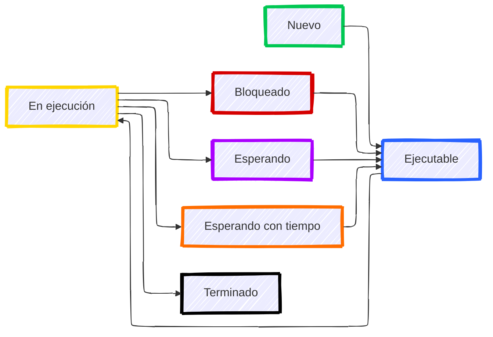

# Introducción a la Programación Multihilo e Hilos de Ejecución

La programación multihilo (también conocida como multithreading) es una técnica de programación que permite que múltiples hilos de ejecución se ejecuten concurrentemente dentro de un mismo proceso. Esta capacidad es fundamental para desarrollar aplicaciones modernas que requieren alta capacidad de respuesta y eficiencia en el uso de recursos.

## ¿Qué es un hilo de ejecución?

Un **hilo** (thread) es la unidad más pequeña de procesamiento que puede ser planificada por el sistema operativo. A diferencia de los procesos, que tienen su propio espacio de memoria independiente, los hilos dentro de un mismo proceso comparten el mismo espacio de direcciones y recursos, lo que los hace más ligeros y eficientes para la comunicación y el intercambio de datos.

:::tip Proceso vs Hilo
Mientras que un **proceso** es una instancia completa de un programa en ejecución con su propio espacio de memoria, un **hilo** es una secuencia de ejecución dentro de ese proceso. Un proceso puede contener múltiples hilos que comparten recursos pero se ejecutan de forma independiente.

Características de los procesos:
- Tienen su propio espacio de memoria
- Son más pesados en términos de recursos
- La comunicación entre procesos requiere mecanismos especiales (IPC)
- Mayor aislamiento y seguridad

Características de los hilos:
- Comparten el espacio de memoria del proceso padre
- Son más ligeros y rápidos de crear
- La comunicación es más sencilla (memoria compartida)
- Menor aislamiento, mayor riesgo de interferencia
:::

### Relación entre hilos y procesos

Cada proceso tiene al menos un hilo de ejecución, conocido como el **hilo principal** o **main thread**. A partir de este hilo principal, se pueden crear hilos adicionales que se ejecutarán de manera concurrente. Todos estos hilos comparten:

- El mismo espacio de direcciones de memoria
- Los descriptores de archivos abiertos
- Las variables globales y el heap
- El código del programa

Sin embargo, cada hilo mantiene su propio:

- Contador de programa (PC)
- Registros de la CPU
- Pila de ejecución (stack)
- Estado de ejecución

Esta estructura permite que los hilos sean mucho más eficientes que los procesos para tareas que requieren comunicación frecuente o acceso a datos compartidos.

## Estados de un hilo

Al igual que los procesos, los hilos atraviesan diferentes estados durante su ciclo de vida. Los estados más comunes son:

- **Nuevo (New)**: El hilo ha sido creado pero aún no ha comenzado su ejecución.
- **Ejecutable (Runnable)**: El hilo está listo para ejecutarse y espera ser asignado a un procesador por el planificador.
- **En ejecución (Running)**: El hilo está actualmente ejecutándose en un procesador.
- **Bloqueado (Blocked)**: El hilo está esperando por un recurso (como un bloqueo o monitor) que está siendo utilizado por otro hilo.
- **Esperando (Waiting)**: El hilo está esperando indefinidamente a que otro hilo realice una acción específica.
- **Esperando con tiempo límite (Timed Waiting)**: El hilo está esperando por otro hilo durante un tiempo específico.
- **Terminado (Terminated)**: El hilo ha completado su ejecución o ha sido finalizado.



## Características de la programación multihilo

La programación multihilo presenta una serie de características y ventajas específicas:

### 1. Capacidad de respuesta (Responsiveness)

Las aplicaciones multihilo pueden mantener su interfaz de usuario receptiva mientras realizan operaciones largas en segundo plano. Por ejemplo, un navegador web puede seguir respondiendo a las interacciones del usuario mientras descarga archivos o renderiza páginas web.

### 2. Compartición de recursos

Los hilos dentro del mismo proceso comparten automáticamente memoria y recursos, lo que facilita la comunicación y reduce la sobrecarga en comparación con la comunicación entre procesos.

### 3. Economía de recursos

Crear y gestionar hilos es significativamente más económico que crear procesos completos, tanto en términos de tiempo como de uso de memoria.

### 4. Aprovechamiento del multiprocesamiento

En sistemas con múltiples núcleos de CPU, los hilos pueden ejecutarse verdaderamente en paralelo, mejorando el rendimiento de la aplicación de manera considerable.

## Ámbitos de aplicación de la programación multihilo

La programación multihilo es especialmente útil en diversos contextos:

### 1. Interfaces gráficas de usuario (GUI)

Las aplicaciones de escritorio y móviles utilizan hilos para mantener la interfaz de usuario fluida mientras realizan operaciones intensivas en el background.

```kotlin
// Ejemplo conceptual de una GUI con hilos
fun loadData() {
    // Crear un hilo para cargar datos sin bloquear la UI
    Thread {
        val data = fetchDataFromServer() // Operación lenta
        // Actualizar la UI en el hilo principal
        runOnUiThread {
            displayData(data)
        }
    }.start()
}
```

### 2. Servidores y servicios

Los servidores web, de bases de datos y de aplicaciones utilizan hilos para manejar múltiples conexiones de clientes simultáneamente.

```kotlin
// Ejemplo conceptual de un servidor multihilo
class SimpleServer(val port: Int) {
    fun start() {
        val serverSocket = ServerSocket(port)
        while (true) {
            val clientSocket = serverSocket.accept()
            // Crear un hilo para cada cliente
            Thread {
                handleClient(clientSocket)
            }.start()
        }
    }
}
```

### 3. Procesamiento paralelo de datos

Las aplicaciones que procesan grandes volúmenes de datos pueden dividir el trabajo entre múltiples hilos para aprovechar los múltiples núcleos de la CPU.

```kotlin
// Ejemplo de procesamiento paralelo
fun processLargeDataset(data: List<Data>) {
    val numThreads = Runtime.getRuntime().availableProcessors()
    val chunkSize = data.size / numThreads
    
    val threads = (0 until numThreads).map { i ->
        Thread {
            val start = i * chunkSize
            val end = if (i == numThreads - 1) data.size else (i + 1) * chunkSize
            processChunk(data.subList(start, end))
        }
    }
    
    threads.forEach { it.start() }
    threads.forEach { it.join() }
}
```

### 4. Aplicaciones en tiempo real

Sistemas de monitoreo, control industrial y aplicaciones de streaming utilizan hilos para manejar múltiples tareas concurrentes con requisitos de tiempo real.

### 5. Juegos y simulaciones

Los motores de juegos utilizan múltiples hilos para gestionar diferentes aspectos como física, renderizado, audio e inteligencia artificial de manera concurrente.

## Ventajas de la programación multihilo

1. **Mejor utilización de la CPU**: Aprovecha los tiempos de espera de operaciones de I/O para realizar otros cálculos.

2. **Mejor experiencia de usuario**: Mantiene la aplicación receptiva incluso durante operaciones largas.

3. **Diseño modular**: Permite separar diferentes tareas en hilos independientes, facilitando el diseño y mantenimiento del código.

4. **Escalabilidad**: Las aplicaciones multihilo pueden escalar mejor en sistemas con múltiples procesadores.

## Desafíos de la programación multihilo

A pesar de sus ventajas, la programación multihilo también presenta desafíos significativos:

### 1. Condiciones de carrera (Race Conditions)

Ocurren cuando dos o más hilos acceden y modifican datos compartidos simultáneamente, produciendo resultados impredecibles.

```kotlin
// Ejemplo de condición de carrera
var counter = 0

fun incrementCounter() {
    repeat(1000) {
        Thread {
            counter++ // ¡No es thread-safe!
        }.start()
    }
}
// El resultado final de counter será impredecible
```

### 2. Interbloqueos (Deadlocks)

Se producen cuando dos o más hilos se quedan esperando indefinidamente por recursos que están siendo retenidos por los otros hilos.

### 3. Inanición (Starvation)

Ocurre cuando un hilo no puede acceder a los recursos que necesita porque otros hilos los están utilizando constantemente.

### 4. Complejidad de depuración

Los errores en programas multihilo son más difíciles de reproducir y depurar debido a la naturaleza no determinista de la ejecución concurrente.

### 5. Sobrecarga de sincronización

El uso excesivo de mecanismos de sincronización puede reducir el rendimiento y anular las ventajas de la concurrencia.

:::warning Importancia de la sincronización
La mayoría de los problemas en programación multihilo surgen por la falta de sincronización adecuada al acceder a recursos compartidos. Es fundamental entender y aplicar correctamente los mecanismos de sincronización que veremos en las siguientes secciones.
:::

## Modelos de threading

Existen diferentes modelos de implementación de hilos:

### 1. Hilos a nivel de usuario (User-level threads)

Gestionados completamente por la aplicación, sin soporte del sistema operativo. Son más rápidos de crear y gestionar, pero no pueden aprovechar múltiples CPUs.

### 2. Hilos a nivel de kernel (Kernel-level threads)

Gestionados directamente por el sistema operativo. Son más pesados pero permiten verdadero paralelismo en sistemas multiprocesador.

### 3. Modelo híbrido

Combina ambos enfoques, con múltiples hilos de usuario mapeados a hilos de kernel. Este es el modelo más común en sistemas operativos modernos.

:::info Threading en la JVM
Kotlin, al ejecutarse sobre la JVM (Java Virtual Machine), utiliza hilos a nivel de kernel. Cada hilo de Kotlin/Java se mapea directamente a un hilo del sistema operativo, lo que permite aprovechar completamente los sistemas multiprocesador.
:::

## Conclusión

La programación multihilo es una herramienta poderosa para crear aplicaciones eficientes y receptivas. Sin embargo, requiere una comprensión profunda de los conceptos de concurrencia y sincronización para evitar problemas comunes. En las siguientes secciones, exploraremos cómo crear y gestionar hilos en Kotlin, así como los mecanismos de sincronización necesarios para escribir código multihilo seguro y eficiente.
